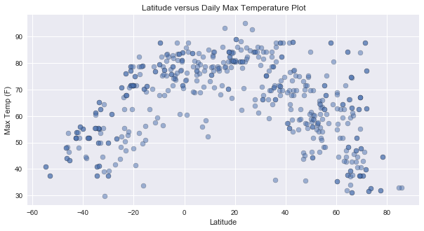
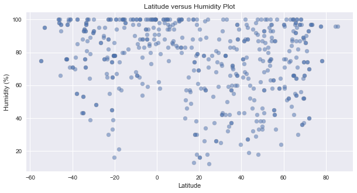
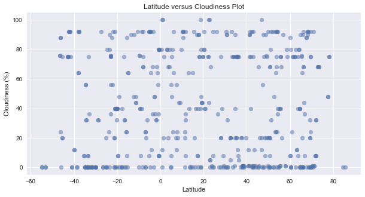
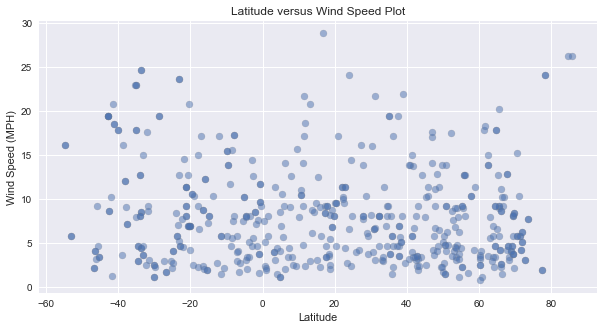

## WeatherPy - Josh Bode

In this example, you'll be creating a Python script to visualize the weather of 500+ cities across the world of varying distance from the equator. To accomplish this, you'll be utilizing a [simple Python library](https://pypi.python.org/pypi/citipy), the [OpenWeatherMap API](https://openweathermap.org/api), and a little common sense to create a representative model of weather across world cities.

Your objective is to build a series of scatter plots to showcase the following relationships:

* Temperature (F) vs. Latitude
* Humidity (%) vs. Latitude
* Cloudiness (%) vs. Latitude
* Wind Speed (mph) vs. Latitude

Your final notebook must:

* Randomly select **at least** 500 unique (non-repeat) cities based on latitude and longitude.
* Perform a weather check on each of the cities using a series of successive API calls. 
* Include a print log of each city as it's being processed with the city number, city name, and requested URL.
* Save both a CSV of all data retrieved and png images for each scatter plot.

As final considerations:

* You must use the Matplotlib and Seaborn libraries.
* You must include a written description of three observable trends based on the data. 
* You must use proper labeling of your plots, including aspects like: Plot Titles (with date of analysis) and Axes Labels.
* You must include an exported markdown version of your Notebook called  `README.md` in your GitHub repository.  
* See [Example Solution](WeatherPy_Example.pdf) for a reference on expected format. 


## Import Libraries


```python
import pandas as pd
import numpy as np
from citipy import citipy
import matplotlib.pyplot as plt
import apikeys
import requests
import json
import gmaps
from pprint import pprint

plt.style.use('seaborn')

# Configure gmaps
gmaps.configure(api_key=apikeys.gmap_key)
```

## Generate cities list

### Randomly sample latitude and longitudes


```python
# RANDOMLY SAMPLE LATITDE AND LONGITUDE COMBINATIONS 
#longitude ranges from -180 to + 180
#Latitude ranges from -90 to 90
np.random.seed(777)
long = np.random.uniform(0, 1, 1000)*360-180
lat =  np.random.uniform(0, 1, 1000)*180-90

lat = lat.tolist()
long = long.tolist()

data_dict = {
    "Latitude": lat, 
    "Longitude": long 
}

data = pd.DataFrame(data_dict)
print(data.describe())
data.head()
```

              Latitude    Longitude
    count  1000.000000  1000.000000
    mean     -1.091046    -4.015971
    std      51.481444   102.557991
    min     -89.942776  -179.568845
    25%     -45.314472   -95.403158
    50%      -0.673413     3.186494
    75%      43.799891    82.200252
    max      89.724395   179.841436
    


<div>
<style scoped>
    .dataframe tbody tr th:only-of-type {
        vertical-align: middle;
    }

    .dataframe tbody tr th {
        vertical-align: top;
    }

    .dataframe thead th {
        text-align: right;
    }
</style>
<table border="1" class="dataframe">
  <thead>
    <tr style="text-align: right;">
      <th></th>
      <th>Latitude</th>
      <th>Longitude</th>
    </tr>
  </thead>
  <tbody>
    <tr>
      <th>0</th>
      <td>-34.962097</td>
      <td>-125.041055</td>
    </tr>
    <tr>
      <th>1</th>
      <td>26.770223</td>
      <td>-71.151621</td>
    </tr>
    <tr>
      <th>2</th>
      <td>-16.054196</td>
      <td>-157.666891</td>
    </tr>
    <tr>
      <th>3</th>
      <td>-50.932404</td>
      <td>-14.450277</td>
    </tr>
    <tr>
      <th>4</th>
      <td>-81.598183</td>
      <td>120.691218</td>
    </tr>
  </tbody>
</table>
</div>


### Find city nearest to each latitude and longitude combination


```python
#Find nearest city
for index, row in data.iterrows():
    city =citipy.nearest_city(row['Latitude'], row['Longitude'])
    data.loc[index, "City"] =f'{city.city_name}, {city.country_code}' 
    
#Check for duplicates
data['dups'] = data.duplicated()
data.dups.value_counts()
del data['dups']

#Show the data
data.head()
```


<div>
<style scoped>
    .dataframe tbody tr th:only-of-type {
        vertical-align: middle;
    }

    .dataframe tbody tr th {
        vertical-align: top;
    }

    .dataframe thead th {
        text-align: right;
    }
</style>
<table border="1" class="dataframe">
  <thead>
    <tr style="text-align: right;">
      <th></th>
      <th>Latitude</th>
      <th>Longitude</th>
      <th>City</th>
    </tr>
  </thead>
  <tbody>
    <tr>
      <th>0</th>
      <td>-34.962097</td>
      <td>-125.041055</td>
      <td>rikitea, pf</td>
    </tr>
    <tr>
      <th>1</th>
      <td>26.770223</td>
      <td>-71.151621</td>
      <td>cockburn town, bs</td>
    </tr>
    <tr>
      <th>2</th>
      <td>-16.054196</td>
      <td>-157.666891</td>
      <td>avarua, ck</td>
    </tr>
    <tr>
      <th>3</th>
      <td>-50.932404</td>
      <td>-14.450277</td>
      <td>jamestown, sh</td>
    </tr>
    <tr>
      <th>4</th>
      <td>-81.598183</td>
      <td>120.691218</td>
      <td>albany, au</td>
    </tr>
  </tbody>
</table>
</div>


### Replace initial lat/long with actual city lat/long - Use Google GeoLocation


```python
#Replace intial lat/long with city actual lat/long

#Google Geolocation API
target_url = "https://maps.googleapis.com/maps/api/geocode/json"

# Iterate over each row
for index, row in data.iterrows():

    #Update parameters for call
    qparams = {
        'address': row['City'],
        'key': apikeys.gmap_key
    }

    # Request geo location of City
    geo_data = requests.get(target_url, params=qparams).json()
    
    #Replace lat/long in row with the corresponding Dictionary contents
    try:
        lat = geo_data["results"][0]["geometry"]["location"]["lat"]
        lng = geo_data["results"][0]["geometry"]["location"]["lng"]
        data.loc[index, 'Latitude'] = lat
        data.loc[index, 'Longitude'] = lng
    except:
        print(f'City not found')
        

data.head()
```

    City not found
    City not found
    City not found
    City not found
    City not found
    City not found
    City not found
    City not found
    City not found
    


<div>
<style scoped>
    .dataframe tbody tr th:only-of-type {
        vertical-align: middle;
    }

    .dataframe tbody tr th {
        vertical-align: top;
    }

    .dataframe thead th {
        text-align: right;
    }
</style>
<table border="1" class="dataframe">
  <thead>
    <tr style="text-align: right;">
      <th></th>
      <th>Latitude</th>
      <th>Longitude</th>
      <th>City</th>
    </tr>
  </thead>
  <tbody>
    <tr>
      <th>0</th>
      <td>-23.119901</td>
      <td>-134.970265</td>
      <td>rikitea, pf</td>
    </tr>
    <tr>
      <th>1</th>
      <td>24.052744</td>
      <td>-74.530216</td>
      <td>cockburn town, bs</td>
    </tr>
    <tr>
      <th>2</th>
      <td>-21.212901</td>
      <td>-159.782306</td>
      <td>avarua, ck</td>
    </tr>
    <tr>
      <th>3</th>
      <td>-15.928634</td>
      <td>-5.715175</td>
      <td>jamestown, sh</td>
    </tr>
    <tr>
      <th>4</th>
      <td>-35.027530</td>
      <td>117.883959</td>
      <td>albany, au</td>
    </tr>
  </tbody>
</table>
</div>


## Perform Weather API calls


```python
url = "http://api.openweathermap.org/data/2.5/weather"


# query_params = {
#     'appid': apikeys.weather_key,
#     'q': 'boulder, colorado',
#     'units' : 'imperial'
# }
# response = requests.get(url, params=query_params).json()
# #pprint(response)
# clouds = response['clouds']['all']
# print(f'Cloudiness: {clouds}')

for index, row in data.iterrows():
    query_params = {
        'appid': apikeys.weather_key,
        'q': row['City'],
        'units' : 'imperial'
    }
    
    try:             
        response = requests.get(url, params=query_params).json()
        data.loc[index, "Max Temperature"] = response['main']['temp_max']
        data.loc[index, "Min Temperature"] = response['main']['temp_min']
        data.loc[index, "Temperature"] = response['main']['temp']
        data.loc[index, "Humidity"] = response['main']['humidity']
        data.loc[index, "Cloudiness"] = response['clouds']['all']
        data.loc[index, "Wind Speed"] = response['wind']['speed']
        print(str(index) + " " + row['City'] + " url:" + url+ "?" + "q=" +query_params['q'])

    except:
        print('Failed to retrieve weather')
        
```

    0 rikitea, pf url:http://api.openweathermap.org/data/2.5/weather?q=rikitea, pf
    1 cockburn town, bs url:http://api.openweathermap.org/data/2.5/weather?q=cockburn town, bs
    2 avarua, ck url:http://api.openweathermap.org/data/2.5/weather?q=avarua, ck
    3 jamestown, sh url:http://api.openweathermap.org/data/2.5/weather?q=jamestown, sh
    4 albany, au url:http://api.openweathermap.org/data/2.5/weather?q=albany, au
    5 hobart, au url:http://api.openweathermap.org/data/2.5/weather?q=hobart, au
    6 dikson, ru url:http://api.openweathermap.org/data/2.5/weather?q=dikson, ru
    Failed to retrieve weather
    8 lebu, cl url:http://api.openweathermap.org/data/2.5/weather?q=lebu, cl
    Failed to retrieve weather
    10 kodiak, us url:http://api.openweathermap.org/data/2.5/weather?q=kodiak, us
    11 hilo, us url:http://api.openweathermap.org/data/2.5/weather?q=hilo, us
    12 chipinge, zw url:http://api.openweathermap.org/data/2.5/weather?q=chipinge, zw
    13 saint-pierre, pm url:http://api.openweathermap.org/data/2.5/weather?q=saint-pierre, pm
    14 waipawa, nz url:http://api.openweathermap.org/data/2.5/weather?q=waipawa, nz
    Failed to retrieve weather
    16 mahebourg, mu url:http://api.openweathermap.org/data/2.5/weather?q=mahebourg, mu
    17 damara, cf url:http://api.openweathermap.org/data/2.5/weather?q=damara, cf
    18 coquimbo, cl url:http://api.openweathermap.org/data/2.5/weather?q=coquimbo, cl
    19 ushuaia, ar url:http://api.openweathermap.org/data/2.5/weather?q=ushuaia, ar
    20 yellowknife, ca url:http://api.openweathermap.org/data/2.5/weather?q=yellowknife, ca
    21 punta arenas, cl url:http://api.openweathermap.org/data/2.5/weather?q=punta arenas, cl
    22 ushuaia, ar url:http://api.openweathermap.org/data/2.5/weather?q=ushuaia, ar
    23 punta arenas, cl url:http://api.openweathermap.org/data/2.5/weather?q=punta arenas, cl
    24 port alfred, za url:http://api.openweathermap.org/data/2.5/weather?q=port alfred, za
    25 merauke, id url:http://api.openweathermap.org/data/2.5/weather?q=merauke, id
    26 port alfred, za url:http://api.openweathermap.org/data/2.5/weather?q=port alfred, za
    27 marquette, us url:http://api.openweathermap.org/data/2.5/weather?q=marquette, us
    28 guerrero negro, mx url:http://api.openweathermap.org/data/2.5/weather?q=guerrero negro, mx
    29 albany, au url:http://api.openweathermap.org/data/2.5/weather?q=albany, au
    30 lebu, cl url:http://api.openweathermap.org/data/2.5/weather?q=lebu, cl
    31 ogaminana, ng url:http://api.openweathermap.org/data/2.5/weather?q=ogaminana, ng
    32 abalak, ne url:http://api.openweathermap.org/data/2.5/weather?q=abalak, ne
    33 samsun, tr url:http://api.openweathermap.org/data/2.5/weather?q=samsun, tr
    34 bilma, ne url:http://api.openweathermap.org/data/2.5/weather?q=bilma, ne
    35 kapaa, us url:http://api.openweathermap.org/data/2.5/weather?q=kapaa, us
    36 namibe, ao url:http://api.openweathermap.org/data/2.5/weather?q=namibe, ao
    37 katsuura, jp url:http://api.openweathermap.org/data/2.5/weather?q=katsuura, jp
    38 khatanga, ru url:http://api.openweathermap.org/data/2.5/weather?q=khatanga, ru
    39 tuktoyaktuk, ca url:http://api.openweathermap.org/data/2.5/weather?q=tuktoyaktuk, ca
    40 riohacha, co url:http://api.openweathermap.org/data/2.5/weather?q=riohacha, co
    41 mtambile, tz url:http://api.openweathermap.org/data/2.5/weather?q=mtambile, tz
    42 tirumullaivasal, in url:http://api.openweathermap.org/data/2.5/weather?q=tirumullaivasal, in
    43 georgetown, sh url:http://api.openweathermap.org/data/2.5/weather?q=georgetown, sh
    44 busselton, au url:http://api.openweathermap.org/data/2.5/weather?q=busselton, au
    45 yellowknife, ca url:http://api.openweathermap.org/data/2.5/weather?q=yellowknife, ca
    46 pavilosta, lv url:http://api.openweathermap.org/data/2.5/weather?q=pavilosta, lv
    47 hermanus, za url:http://api.openweathermap.org/data/2.5/weather?q=hermanus, za
    48 jamestown, sh url:http://api.openweathermap.org/data/2.5/weather?q=jamestown, sh
    49 shitanjing, cn url:http://api.openweathermap.org/data/2.5/weather?q=shitanjing, cn
    50 rikitea, pf url:http://api.openweathermap.org/data/2.5/weather?q=rikitea, pf
    51 taywarah, af url:http://api.openweathermap.org/data/2.5/weather?q=taywarah, af
    52 upernavik, gl url:http://api.openweathermap.org/data/2.5/weather?q=upernavik, gl
    53 necochea, ar url:http://api.openweathermap.org/data/2.5/weather?q=necochea, ar
    54 georgetown, sh url:http://api.openweathermap.org/data/2.5/weather?q=georgetown, sh
    55 alofi, nu url:http://api.openweathermap.org/data/2.5/weather?q=alofi, nu
    56 cidreira, br url:http://api.openweathermap.org/data/2.5/weather?q=cidreira, br
    57 gladstone, au url:http://api.openweathermap.org/data/2.5/weather?q=gladstone, au
    Failed to retrieve weather
    59 hamilton, bm url:http://api.openweathermap.org/data/2.5/weather?q=hamilton, bm
    60 benguela, ao url:http://api.openweathermap.org/data/2.5/weather?q=benguela, ao
    61 ushuaia, ar url:http://api.openweathermap.org/data/2.5/weather?q=ushuaia, ar
    62 dingle, ie url:http://api.openweathermap.org/data/2.5/weather?q=dingle, ie
    Failed to retrieve weather
    64 atuona, pf url:http://api.openweathermap.org/data/2.5/weather?q=atuona, pf
    65 mahebourg, mu url:http://api.openweathermap.org/data/2.5/weather?q=mahebourg, mu
    66 albany, au url:http://api.openweathermap.org/data/2.5/weather?q=albany, au
    67 caravelas, br url:http://api.openweathermap.org/data/2.5/weather?q=caravelas, br
    68 magdagachi, ru url:http://api.openweathermap.org/data/2.5/weather?q=magdagachi, ru
    69 surt, ly url:http://api.openweathermap.org/data/2.5/weather?q=surt, ly
    70 mar del plata, ar url:http://api.openweathermap.org/data/2.5/weather?q=mar del plata, ar
    71 busselton, au url:http://api.openweathermap.org/data/2.5/weather?q=busselton, au
    Failed to retrieve weather
    73 hobart, au url:http://api.openweathermap.org/data/2.5/weather?q=hobart, au
    74 ushuaia, ar url:http://api.openweathermap.org/data/2.5/weather?q=ushuaia, ar
    75 mount isa, au url:http://api.openweathermap.org/data/2.5/weather?q=mount isa, au
    76 qaanaaq, gl url:http://api.openweathermap.org/data/2.5/weather?q=qaanaaq, gl
    77 ipixuna, br url:http://api.openweathermap.org/data/2.5/weather?q=ipixuna, br
    78 quang ngai, vn url:http://api.openweathermap.org/data/2.5/weather?q=quang ngai, vn
    79 genhe, cn url:http://api.openweathermap.org/data/2.5/weather?q=genhe, cn
    80 east london, za url:http://api.openweathermap.org/data/2.5/weather?q=east london, za
    81 rio branco, br url:http://api.openweathermap.org/data/2.5/weather?q=rio branco, br
    82 kapaa, us url:http://api.openweathermap.org/data/2.5/weather?q=kapaa, us
    Failed to retrieve weather
    84 luba, gq url:http://api.openweathermap.org/data/2.5/weather?q=luba, gq
    85 kapaa, us url:http://api.openweathermap.org/data/2.5/weather?q=kapaa, us
    86 hovd, mn url:http://api.openweathermap.org/data/2.5/weather?q=hovd, mn
    87 pandan, ph url:http://api.openweathermap.org/data/2.5/weather?q=pandan, ph
    88 eureka, us url:http://api.openweathermap.org/data/2.5/weather?q=eureka, us
    89 taltal, cl url:http://api.openweathermap.org/data/2.5/weather?q=taltal, cl
    90 narsaq, gl url:http://api.openweathermap.org/data/2.5/weather?q=narsaq, gl
    91 hasaki, jp url:http://api.openweathermap.org/data/2.5/weather?q=hasaki, jp
    92 butaritari, ki url:http://api.openweathermap.org/data/2.5/weather?q=butaritari, ki
    93 busselton, au url:http://api.openweathermap.org/data/2.5/weather?q=busselton, au
    Failed to retrieve weather
    95 te anau, nz url:http://api.openweathermap.org/data/2.5/weather?q=te anau, nz
    96 pevek, ru url:http://api.openweathermap.org/data/2.5/weather?q=pevek, ru
    97 punta arenas, cl url:http://api.openweathermap.org/data/2.5/weather?q=punta arenas, cl
    Failed to retrieve weather
    Failed to retrieve weather
    100 yeppoon, au url:http://api.openweathermap.org/data/2.5/weather?q=yeppoon, au
    101 hithadhoo, mv url:http://api.openweathermap.org/data/2.5/weather?q=hithadhoo, mv
    102 rolla, us url:http://api.openweathermap.org/data/2.5/weather?q=rolla, us
    103 vaini, to url:http://api.openweathermap.org/data/2.5/weather?q=vaini, to
    104 surgut, ru url:http://api.openweathermap.org/data/2.5/weather?q=surgut, ru
    105 pa sang, th url:http://api.openweathermap.org/data/2.5/weather?q=pa sang, th
    Failed to retrieve weather
    107 busselton, au url:http://api.openweathermap.org/data/2.5/weather?q=busselton, au
    108 punta arenas, cl url:http://api.openweathermap.org/data/2.5/weather?q=punta arenas, cl
    109 hithadhoo, mv url:http://api.openweathermap.org/data/2.5/weather?q=hithadhoo, mv
    110 cayenne, gf url:http://api.openweathermap.org/data/2.5/weather?q=cayenne, gf
    111 gravdal, no url:http://api.openweathermap.org/data/2.5/weather?q=gravdal, no
    Failed to retrieve weather
    113 torbay, ca url:http://api.openweathermap.org/data/2.5/weather?q=torbay, ca
    114 bikapur, in url:http://api.openweathermap.org/data/2.5/weather?q=bikapur, in
    115 chuy, uy url:http://api.openweathermap.org/data/2.5/weather?q=chuy, uy
    116 atuona, pf url:http://api.openweathermap.org/data/2.5/weather?q=atuona, pf
    Failed to retrieve weather
    118 sorland, no url:http://api.openweathermap.org/data/2.5/weather?q=sorland, no
    Failed to retrieve weather
    120 new norfolk, au url:http://api.openweathermap.org/data/2.5/weather?q=new norfolk, au
    121 hermanus, za url:http://api.openweathermap.org/data/2.5/weather?q=hermanus, za
    122 port alfred, za url:http://api.openweathermap.org/data/2.5/weather?q=port alfred, za
    123 saskylakh, ru url:http://api.openweathermap.org/data/2.5/weather?q=saskylakh, ru
    124 provideniya, ru url:http://api.openweathermap.org/data/2.5/weather?q=provideniya, ru
    125 kungurtug, ru url:http://api.openweathermap.org/data/2.5/weather?q=kungurtug, ru
    126 albany, au url:http://api.openweathermap.org/data/2.5/weather?q=albany, au
    127 hoi an, vn url:http://api.openweathermap.org/data/2.5/weather?q=hoi an, vn
    128 rikitea, pf url:http://api.openweathermap.org/data/2.5/weather?q=rikitea, pf
    129 broken hill, au url:http://api.openweathermap.org/data/2.5/weather?q=broken hill, au
    130 hilo, us url:http://api.openweathermap.org/data/2.5/weather?q=hilo, us
    131 puerto ayora, ec url:http://api.openweathermap.org/data/2.5/weather?q=puerto ayora, ec
    132 geraldton, au url:http://api.openweathermap.org/data/2.5/weather?q=geraldton, au
    133 fairbanks, us url:http://api.openweathermap.org/data/2.5/weather?q=fairbanks, us
    Failed to retrieve weather
    135 maniitsoq, gl url:http://api.openweathermap.org/data/2.5/weather?q=maniitsoq, gl
    136 agutaya, ph url:http://api.openweathermap.org/data/2.5/weather?q=agutaya, ph
    137 kapaa, us url:http://api.openweathermap.org/data/2.5/weather?q=kapaa, us
    138 victoria, sc url:http://api.openweathermap.org/data/2.5/weather?q=victoria, sc
    139 victoria, sc url:http://api.openweathermap.org/data/2.5/weather?q=victoria, sc
    140 soc trang, vn url:http://api.openweathermap.org/data/2.5/weather?q=soc trang, vn
    141 saquena, pe url:http://api.openweathermap.org/data/2.5/weather?q=saquena, pe
    142 severo-yeniseyskiy, ru url:http://api.openweathermap.org/data/2.5/weather?q=severo-yeniseyskiy, ru
    143 albany, au url:http://api.openweathermap.org/data/2.5/weather?q=albany, au
    144 cidreira, br url:http://api.openweathermap.org/data/2.5/weather?q=cidreira, br
    145 ushuaia, ar url:http://api.openweathermap.org/data/2.5/weather?q=ushuaia, ar
    146 kalmunai, lk url:http://api.openweathermap.org/data/2.5/weather?q=kalmunai, lk
    Failed to retrieve weather
    148 busselton, au url:http://api.openweathermap.org/data/2.5/weather?q=busselton, au
    149 bredasdorp, za url:http://api.openweathermap.org/data/2.5/weather?q=bredasdorp, za
    150 tuatapere, nz url:http://api.openweathermap.org/data/2.5/weather?q=tuatapere, nz
    151 san jose de sisa, pe url:http://api.openweathermap.org/data/2.5/weather?q=san jose de sisa, pe
    152 antalaha, mg url:http://api.openweathermap.org/data/2.5/weather?q=antalaha, mg
    153 wanning, cn url:http://api.openweathermap.org/data/2.5/weather?q=wanning, cn
    154 arraial do cabo, br url:http://api.openweathermap.org/data/2.5/weather?q=arraial do cabo, br
    155 luderitz, na url:http://api.openweathermap.org/data/2.5/weather?q=luderitz, na
    156 rikitea, pf url:http://api.openweathermap.org/data/2.5/weather?q=rikitea, pf
    157 grants pass, us url:http://api.openweathermap.org/data/2.5/weather?q=grants pass, us
    158 avarua, ck url:http://api.openweathermap.org/data/2.5/weather?q=avarua, ck
    Failed to retrieve weather
    Failed to retrieve weather
    161 rikitea, pf url:http://api.openweathermap.org/data/2.5/weather?q=rikitea, pf
    162 tianpeng, cn url:http://api.openweathermap.org/data/2.5/weather?q=tianpeng, cn
    163 half moon bay, us url:http://api.openweathermap.org/data/2.5/weather?q=half moon bay, us
    164 bedele, et url:http://api.openweathermap.org/data/2.5/weather?q=bedele, et
    165 mayumba, ga url:http://api.openweathermap.org/data/2.5/weather?q=mayumba, ga
    Failed to retrieve weather
    Failed to retrieve weather
    168 haiger, de url:http://api.openweathermap.org/data/2.5/weather?q=haiger, de
    169 vaini, to url:http://api.openweathermap.org/data/2.5/weather?q=vaini, to
    170 vaini, to url:http://api.openweathermap.org/data/2.5/weather?q=vaini, to
    171 katsuura, jp url:http://api.openweathermap.org/data/2.5/weather?q=katsuura, jp
    172 kahului, us url:http://api.openweathermap.org/data/2.5/weather?q=kahului, us
    173 rikitea, pf url:http://api.openweathermap.org/data/2.5/weather?q=rikitea, pf
    174 geraldton, au url:http://api.openweathermap.org/data/2.5/weather?q=geraldton, au
    175 mar del plata, ar url:http://api.openweathermap.org/data/2.5/weather?q=mar del plata, ar
    176 avarua, ck url:http://api.openweathermap.org/data/2.5/weather?q=avarua, ck
    Failed to retrieve weather
    178 mar del plata, ar url:http://api.openweathermap.org/data/2.5/weather?q=mar del plata, ar
    179 hithadhoo, mv url:http://api.openweathermap.org/data/2.5/weather?q=hithadhoo, mv
    180 punta arenas, cl url:http://api.openweathermap.org/data/2.5/weather?q=punta arenas, cl
    Failed to retrieve weather
    182 asyut, eg url:http://api.openweathermap.org/data/2.5/weather?q=asyut, eg
    183 yar-sale, ru url:http://api.openweathermap.org/data/2.5/weather?q=yar-sale, ru
    184 kutum, sd url:http://api.openweathermap.org/data/2.5/weather?q=kutum, sd
    185 marawi, sd url:http://api.openweathermap.org/data/2.5/weather?q=marawi, sd
    186 bluff, nz url:http://api.openweathermap.org/data/2.5/weather?q=bluff, nz
    187 barrow, us url:http://api.openweathermap.org/data/2.5/weather?q=barrow, us
    188 rikitea, pf url:http://api.openweathermap.org/data/2.5/weather?q=rikitea, pf
    189 punta arenas, cl url:http://api.openweathermap.org/data/2.5/weather?q=punta arenas, cl
    190 rikitea, pf url:http://api.openweathermap.org/data/2.5/weather?q=rikitea, pf
    191 perris, us url:http://api.openweathermap.org/data/2.5/weather?q=perris, us
    192 launceston, au url:http://api.openweathermap.org/data/2.5/weather?q=launceston, au
    Failed to retrieve weather
    194 hanzhong, cn url:http://api.openweathermap.org/data/2.5/weather?q=hanzhong, cn
    195 northam, au url:http://api.openweathermap.org/data/2.5/weather?q=northam, au
    196 lumberton, us url:http://api.openweathermap.org/data/2.5/weather?q=lumberton, us
    197 ushuaia, ar url:http://api.openweathermap.org/data/2.5/weather?q=ushuaia, ar
    198 hami, cn url:http://api.openweathermap.org/data/2.5/weather?q=hami, cn
    Failed to retrieve weather
    Failed to retrieve weather
    201 hermanus, za url:http://api.openweathermap.org/data/2.5/weather?q=hermanus, za
    202 rikitea, pf url:http://api.openweathermap.org/data/2.5/weather?q=rikitea, pf
    203 cape town, za url:http://api.openweathermap.org/data/2.5/weather?q=cape town, za
    204 staryy nadym, ru url:http://api.openweathermap.org/data/2.5/weather?q=staryy nadym, ru
    Failed to retrieve weather
    206 kodiak, us url:http://api.openweathermap.org/data/2.5/weather?q=kodiak, us
    Failed to retrieve weather
    208 gravelbourg, ca url:http://api.openweathermap.org/data/2.5/weather?q=gravelbourg, ca
    209 albany, au url:http://api.openweathermap.org/data/2.5/weather?q=albany, au
    210 powell river, ca url:http://api.openweathermap.org/data/2.5/weather?q=powell river, ca
    211 ushuaia, ar url:http://api.openweathermap.org/data/2.5/weather?q=ushuaia, ar
    212 rio formoso, br url:http://api.openweathermap.org/data/2.5/weather?q=rio formoso, br
    Failed to retrieve weather
    214 ribeira grande, pt url:http://api.openweathermap.org/data/2.5/weather?q=ribeira grande, pt
    Failed to retrieve weather
    216 vikarabad, in url:http://api.openweathermap.org/data/2.5/weather?q=vikarabad, in
    Failed to retrieve weather
    Failed to retrieve weather
    219 busselton, au url:http://api.openweathermap.org/data/2.5/weather?q=busselton, au
    220 thompson, ca url:http://api.openweathermap.org/data/2.5/weather?q=thompson, ca
    221 cap malheureux, mu url:http://api.openweathermap.org/data/2.5/weather?q=cap malheureux, mu
    222 nanortalik, gl url:http://api.openweathermap.org/data/2.5/weather?q=nanortalik, gl
    223 bredasdorp, za url:http://api.openweathermap.org/data/2.5/weather?q=bredasdorp, za
    224 atuona, pf url:http://api.openweathermap.org/data/2.5/weather?q=atuona, pf
    225 lebu, cl url:http://api.openweathermap.org/data/2.5/weather?q=lebu, cl
    Failed to retrieve weather
    227 bethel, us url:http://api.openweathermap.org/data/2.5/weather?q=bethel, us
    228 san patricio, mx url:http://api.openweathermap.org/data/2.5/weather?q=san patricio, mx
    229 coahuayana, mx url:http://api.openweathermap.org/data/2.5/weather?q=coahuayana, mx
    230 tiksi, ru url:http://api.openweathermap.org/data/2.5/weather?q=tiksi, ru
    231 ribeira grande, pt url:http://api.openweathermap.org/data/2.5/weather?q=ribeira grande, pt
    232 san juan, ar url:http://api.openweathermap.org/data/2.5/weather?q=san juan, ar
    233 hithadhoo, mv url:http://api.openweathermap.org/data/2.5/weather?q=hithadhoo, mv
    234 burnie, au url:http://api.openweathermap.org/data/2.5/weather?q=burnie, au
    235 ushuaia, ar url:http://api.openweathermap.org/data/2.5/weather?q=ushuaia, ar
    Failed to retrieve weather
    237 atuona, pf url:http://api.openweathermap.org/data/2.5/weather?q=atuona, pf
    238 galbshtadt, ru url:http://api.openweathermap.org/data/2.5/weather?q=galbshtadt, ru
    239 east london, za url:http://api.openweathermap.org/data/2.5/weather?q=east london, za
    240 kuching, my url:http://api.openweathermap.org/data/2.5/weather?q=kuching, my
    241 waddan, ly url:http://api.openweathermap.org/data/2.5/weather?q=waddan, ly
    242 vaini, to url:http://api.openweathermap.org/data/2.5/weather?q=vaini, to
    243 hermanus, za url:http://api.openweathermap.org/data/2.5/weather?q=hermanus, za
    Failed to retrieve weather
    245 ponta do sol, cv url:http://api.openweathermap.org/data/2.5/weather?q=ponta do sol, cv
    246 tiksi, ru url:http://api.openweathermap.org/data/2.5/weather?q=tiksi, ru
    247 jamestown, sh url:http://api.openweathermap.org/data/2.5/weather?q=jamestown, sh
    248 new norfolk, au url:http://api.openweathermap.org/data/2.5/weather?q=new norfolk, au
    249 rikitea, pf url:http://api.openweathermap.org/data/2.5/weather?q=rikitea, pf
    250 pangnirtung, ca url:http://api.openweathermap.org/data/2.5/weather?q=pangnirtung, ca
    251 zabol, ir url:http://api.openweathermap.org/data/2.5/weather?q=zabol, ir
    252 ushuaia, ar url:http://api.openweathermap.org/data/2.5/weather?q=ushuaia, ar
    253 hasaki, jp url:http://api.openweathermap.org/data/2.5/weather?q=hasaki, jp
    254 westport, ie url:http://api.openweathermap.org/data/2.5/weather?q=westport, ie
    255 hilo, us url:http://api.openweathermap.org/data/2.5/weather?q=hilo, us
    256 guanay, bo url:http://api.openweathermap.org/data/2.5/weather?q=guanay, bo
    257 jamestown, sh url:http://api.openweathermap.org/data/2.5/weather?q=jamestown, sh
    258 farmington, us url:http://api.openweathermap.org/data/2.5/weather?q=farmington, us
    259 kodiak, us url:http://api.openweathermap.org/data/2.5/weather?q=kodiak, us
    260 thompson, ca url:http://api.openweathermap.org/data/2.5/weather?q=thompson, ca
    261 hilo, us url:http://api.openweathermap.org/data/2.5/weather?q=hilo, us
    262 bethel, us url:http://api.openweathermap.org/data/2.5/weather?q=bethel, us
    263 dikson, ru url:http://api.openweathermap.org/data/2.5/weather?q=dikson, ru
    264 qaanaaq, gl url:http://api.openweathermap.org/data/2.5/weather?q=qaanaaq, gl
    265 vaini, to url:http://api.openweathermap.org/data/2.5/weather?q=vaini, to
    Failed to retrieve weather
    267 lebu, cl url:http://api.openweathermap.org/data/2.5/weather?q=lebu, cl
    268 rikitea, pf url:http://api.openweathermap.org/data/2.5/weather?q=rikitea, pf
    269 ordynskoye, ru url:http://api.openweathermap.org/data/2.5/weather?q=ordynskoye, ru
    270 ushuaia, ar url:http://api.openweathermap.org/data/2.5/weather?q=ushuaia, ar
    Failed to retrieve weather
    272 avarua, ck url:http://api.openweathermap.org/data/2.5/weather?q=avarua, ck
    Failed to retrieve weather
    274 cidreira, br url:http://api.openweathermap.org/data/2.5/weather?q=cidreira, br
    275 severo-kurilsk, ru url:http://api.openweathermap.org/data/2.5/weather?q=severo-kurilsk, ru
    276 worland, us url:http://api.openweathermap.org/data/2.5/weather?q=worland, us
    277 mar del plata, ar url:http://api.openweathermap.org/data/2.5/weather?q=mar del plata, ar
    278 ushuaia, ar url:http://api.openweathermap.org/data/2.5/weather?q=ushuaia, ar
    279 kaitangata, nz url:http://api.openweathermap.org/data/2.5/weather?q=kaitangata, nz
    Failed to retrieve weather
    281 ituporanga, br url:http://api.openweathermap.org/data/2.5/weather?q=ituporanga, br
    282 bandipur, in url:http://api.openweathermap.org/data/2.5/weather?q=bandipur, in
    283 provideniya, ru url:http://api.openweathermap.org/data/2.5/weather?q=provideniya, ru
    284 norman wells, ca url:http://api.openweathermap.org/data/2.5/weather?q=norman wells, ca
    285 talnakh, ru url:http://api.openweathermap.org/data/2.5/weather?q=talnakh, ru
    286 arraial do cabo, br url:http://api.openweathermap.org/data/2.5/weather?q=arraial do cabo, br
    287 geraldton, au url:http://api.openweathermap.org/data/2.5/weather?q=geraldton, au
    288 kagalnitskaya, ru url:http://api.openweathermap.org/data/2.5/weather?q=kagalnitskaya, ru
    289 punta arenas, cl url:http://api.openweathermap.org/data/2.5/weather?q=punta arenas, cl
    290 ponta do sol, cv url:http://api.openweathermap.org/data/2.5/weather?q=ponta do sol, cv
    291 castro, cl url:http://api.openweathermap.org/data/2.5/weather?q=castro, cl
    292 adrar, dz url:http://api.openweathermap.org/data/2.5/weather?q=adrar, dz
    293 dikson, ru url:http://api.openweathermap.org/data/2.5/weather?q=dikson, ru
    294 palafrugell, es url:http://api.openweathermap.org/data/2.5/weather?q=palafrugell, es
    Failed to retrieve weather
    296 banda aceh, id url:http://api.openweathermap.org/data/2.5/weather?q=banda aceh, id
    297 kapaa, us url:http://api.openweathermap.org/data/2.5/weather?q=kapaa, us
    298 mahebourg, mu url:http://api.openweathermap.org/data/2.5/weather?q=mahebourg, mu
    299 rikitea, pf url:http://api.openweathermap.org/data/2.5/weather?q=rikitea, pf
    300 cherskiy, ru url:http://api.openweathermap.org/data/2.5/weather?q=cherskiy, ru
    301 punta arenas, cl url:http://api.openweathermap.org/data/2.5/weather?q=punta arenas, cl
    302 ginir, et url:http://api.openweathermap.org/data/2.5/weather?q=ginir, et
    Failed to retrieve weather
    304 kodiak, us url:http://api.openweathermap.org/data/2.5/weather?q=kodiak, us
    305 butaritari, ki url:http://api.openweathermap.org/data/2.5/weather?q=butaritari, ki
    306 butaritari, ki url:http://api.openweathermap.org/data/2.5/weather?q=butaritari, ki
    307 ushuaia, ar url:http://api.openweathermap.org/data/2.5/weather?q=ushuaia, ar
    308 tokur, ru url:http://api.openweathermap.org/data/2.5/weather?q=tokur, ru
    309 atuona, pf url:http://api.openweathermap.org/data/2.5/weather?q=atuona, pf
    310 mar del plata, ar url:http://api.openweathermap.org/data/2.5/weather?q=mar del plata, ar
    311 ondangwa, na url:http://api.openweathermap.org/data/2.5/weather?q=ondangwa, na
    312 jamestown, sh url:http://api.openweathermap.org/data/2.5/weather?q=jamestown, sh
    313 chuy, uy url:http://api.openweathermap.org/data/2.5/weather?q=chuy, uy
    314 college, us url:http://api.openweathermap.org/data/2.5/weather?q=college, us
    315 gamba, ga url:http://api.openweathermap.org/data/2.5/weather?q=gamba, ga
    Failed to retrieve weather
    Failed to retrieve weather
    318 longyearbyen, sj url:http://api.openweathermap.org/data/2.5/weather?q=longyearbyen, sj
    319 teya, ru url:http://api.openweathermap.org/data/2.5/weather?q=teya, ru
    320 palmer, us url:http://api.openweathermap.org/data/2.5/weather?q=palmer, us
    321 yulin, cn url:http://api.openweathermap.org/data/2.5/weather?q=yulin, cn
    322 tasiilaq, gl url:http://api.openweathermap.org/data/2.5/weather?q=tasiilaq, gl
    323 rikitea, pf url:http://api.openweathermap.org/data/2.5/weather?q=rikitea, pf
    324 chitral, pk url:http://api.openweathermap.org/data/2.5/weather?q=chitral, pk
    325 norderstedt, de url:http://api.openweathermap.org/data/2.5/weather?q=norderstedt, de
    326 georgetown, sh url:http://api.openweathermap.org/data/2.5/weather?q=georgetown, sh
    327 pozo colorado, py url:http://api.openweathermap.org/data/2.5/weather?q=pozo colorado, py
    328 tuktoyaktuk, ca url:http://api.openweathermap.org/data/2.5/weather?q=tuktoyaktuk, ca
    329 turbat, pk url:http://api.openweathermap.org/data/2.5/weather?q=turbat, pk
    Failed to retrieve weather
    331 hobart, au url:http://api.openweathermap.org/data/2.5/weather?q=hobart, au
    332 yellowknife, ca url:http://api.openweathermap.org/data/2.5/weather?q=yellowknife, ca
    333 rikitea, pf url:http://api.openweathermap.org/data/2.5/weather?q=rikitea, pf
    334 albany, au url:http://api.openweathermap.org/data/2.5/weather?q=albany, au
    335 ribeira grande, pt url:http://api.openweathermap.org/data/2.5/weather?q=ribeira grande, pt
    336 busselton, au url:http://api.openweathermap.org/data/2.5/weather?q=busselton, au
    Failed to retrieve weather
    338 mae sai, th url:http://api.openweathermap.org/data/2.5/weather?q=mae sai, th
    339 flinders, au url:http://api.openweathermap.org/data/2.5/weather?q=flinders, au
    340 mugur-aksy, ru url:http://api.openweathermap.org/data/2.5/weather?q=mugur-aksy, ru
    341 kungurtug, ru url:http://api.openweathermap.org/data/2.5/weather?q=kungurtug, ru
    342 chernyshevskiy, ru url:http://api.openweathermap.org/data/2.5/weather?q=chernyshevskiy, ru
    343 padang, id url:http://api.openweathermap.org/data/2.5/weather?q=padang, id
    344 zima, ru url:http://api.openweathermap.org/data/2.5/weather?q=zima, ru
    345 nanortalik, gl url:http://api.openweathermap.org/data/2.5/weather?q=nanortalik, gl
    Failed to retrieve weather
    347 aklavik, ca url:http://api.openweathermap.org/data/2.5/weather?q=aklavik, ca
    348 punta arenas, cl url:http://api.openweathermap.org/data/2.5/weather?q=punta arenas, cl
    349 longyearbyen, sj url:http://api.openweathermap.org/data/2.5/weather?q=longyearbyen, sj
    350 springdale, us url:http://api.openweathermap.org/data/2.5/weather?q=springdale, us
    351 adrar, dz url:http://api.openweathermap.org/data/2.5/weather?q=adrar, dz
    352 punta arenas, cl url:http://api.openweathermap.org/data/2.5/weather?q=punta arenas, cl
    Failed to retrieve weather
    354 ushuaia, ar url:http://api.openweathermap.org/data/2.5/weather?q=ushuaia, ar
    355 sinnamary, gf url:http://api.openweathermap.org/data/2.5/weather?q=sinnamary, gf
    356 port alfred, za url:http://api.openweathermap.org/data/2.5/weather?q=port alfred, za
    Failed to retrieve weather
    358 cape town, za url:http://api.openweathermap.org/data/2.5/weather?q=cape town, za
    359 zhezkazgan, kz url:http://api.openweathermap.org/data/2.5/weather?q=zhezkazgan, kz
    360 muroto, jp url:http://api.openweathermap.org/data/2.5/weather?q=muroto, jp
    361 albany, au url:http://api.openweathermap.org/data/2.5/weather?q=albany, au
    362 cidreira, br url:http://api.openweathermap.org/data/2.5/weather?q=cidreira, br
    363 longyearbyen, sj url:http://api.openweathermap.org/data/2.5/weather?q=longyearbyen, sj
    364 barguzin, ru url:http://api.openweathermap.org/data/2.5/weather?q=barguzin, ru
    365 umm kaddadah, sd url:http://api.openweathermap.org/data/2.5/weather?q=umm kaddadah, sd
    366 bexhill, gb url:http://api.openweathermap.org/data/2.5/weather?q=bexhill, gb
    367 tuktoyaktuk, ca url:http://api.openweathermap.org/data/2.5/weather?q=tuktoyaktuk, ca
    368 ribeira grande, pt url:http://api.openweathermap.org/data/2.5/weather?q=ribeira grande, pt
    369 ales, fr url:http://api.openweathermap.org/data/2.5/weather?q=ales, fr
    370 rikitea, pf url:http://api.openweathermap.org/data/2.5/weather?q=rikitea, pf
    371 ushuaia, ar url:http://api.openweathermap.org/data/2.5/weather?q=ushuaia, ar
    372 rikitea, pf url:http://api.openweathermap.org/data/2.5/weather?q=rikitea, pf
    373 poltavka, ru url:http://api.openweathermap.org/data/2.5/weather?q=poltavka, ru
    374 severo-kurilsk, ru url:http://api.openweathermap.org/data/2.5/weather?q=severo-kurilsk, ru
    375 east london, za url:http://api.openweathermap.org/data/2.5/weather?q=east london, za
    376 clyde river, ca url:http://api.openweathermap.org/data/2.5/weather?q=clyde river, ca
    Failed to retrieve weather
    378 vanimo, pg url:http://api.openweathermap.org/data/2.5/weather?q=vanimo, pg
    379 orikhove, ua url:http://api.openweathermap.org/data/2.5/weather?q=orikhove, ua
    380 nhulunbuy, au url:http://api.openweathermap.org/data/2.5/weather?q=nhulunbuy, au
    381 arkhangelsk, ru url:http://api.openweathermap.org/data/2.5/weather?q=arkhangelsk, ru
    382 severo-kurilsk, ru url:http://api.openweathermap.org/data/2.5/weather?q=severo-kurilsk, ru
    383 rikitea, pf url:http://api.openweathermap.org/data/2.5/weather?q=rikitea, pf
    384 bethel, us url:http://api.openweathermap.org/data/2.5/weather?q=bethel, us
    385 upernavik, gl url:http://api.openweathermap.org/data/2.5/weather?q=upernavik, gl
    Failed to retrieve weather
    387 georgetown, sh url:http://api.openweathermap.org/data/2.5/weather?q=georgetown, sh
    388 mackay, au url:http://api.openweathermap.org/data/2.5/weather?q=mackay, au
    389 lazaro cardenas, mx url:http://api.openweathermap.org/data/2.5/weather?q=lazaro cardenas, mx
    390 hermanus, za url:http://api.openweathermap.org/data/2.5/weather?q=hermanus, za
    391 hasaki, jp url:http://api.openweathermap.org/data/2.5/weather?q=hasaki, jp
    392 gorontalo, id url:http://api.openweathermap.org/data/2.5/weather?q=gorontalo, id
    Failed to retrieve weather
    394 albany, au url:http://api.openweathermap.org/data/2.5/weather?q=albany, au
    395 sao filipe, cv url:http://api.openweathermap.org/data/2.5/weather?q=sao filipe, cv
    396 stralsund, de url:http://api.openweathermap.org/data/2.5/weather?q=stralsund, de
    397 barrow, us url:http://api.openweathermap.org/data/2.5/weather?q=barrow, us
    Failed to retrieve weather
    399 bredasdorp, za url:http://api.openweathermap.org/data/2.5/weather?q=bredasdorp, za
    400 bethel, us url:http://api.openweathermap.org/data/2.5/weather?q=bethel, us
    401 port blair, in url:http://api.openweathermap.org/data/2.5/weather?q=port blair, in
    402 ushuaia, ar url:http://api.openweathermap.org/data/2.5/weather?q=ushuaia, ar
    403 vaini, to url:http://api.openweathermap.org/data/2.5/weather?q=vaini, to
    404 bluff, nz url:http://api.openweathermap.org/data/2.5/weather?q=bluff, nz
    405 ihiala, ng url:http://api.openweathermap.org/data/2.5/weather?q=ihiala, ng
    406 bambous virieux, mu url:http://api.openweathermap.org/data/2.5/weather?q=bambous virieux, mu
    407 lucapa, ao url:http://api.openweathermap.org/data/2.5/weather?q=lucapa, ao
    Failed to retrieve weather
    409 luderitz, na url:http://api.openweathermap.org/data/2.5/weather?q=luderitz, na
    410 santa luzia, br url:http://api.openweathermap.org/data/2.5/weather?q=santa luzia, br
    Failed to retrieve weather
    Failed to retrieve weather
    413 khasan, ru url:http://api.openweathermap.org/data/2.5/weather?q=khasan, ru
    414 rikitea, pf url:http://api.openweathermap.org/data/2.5/weather?q=rikitea, pf
    415 kapaa, us url:http://api.openweathermap.org/data/2.5/weather?q=kapaa, us
    416 thompson, ca url:http://api.openweathermap.org/data/2.5/weather?q=thompson, ca
    417 rikitea, pf url:http://api.openweathermap.org/data/2.5/weather?q=rikitea, pf
    418 cape town, za url:http://api.openweathermap.org/data/2.5/weather?q=cape town, za
    419 punta arenas, cl url:http://api.openweathermap.org/data/2.5/weather?q=punta arenas, cl
    420 dinard, fr url:http://api.openweathermap.org/data/2.5/weather?q=dinard, fr
    421 nizwa, om url:http://api.openweathermap.org/data/2.5/weather?q=nizwa, om
    422 port alfred, za url:http://api.openweathermap.org/data/2.5/weather?q=port alfred, za
    423 balkanabat, tm url:http://api.openweathermap.org/data/2.5/weather?q=balkanabat, tm
    424 hays, us url:http://api.openweathermap.org/data/2.5/weather?q=hays, us
    Failed to retrieve weather
    426 kavieng, pg url:http://api.openweathermap.org/data/2.5/weather?q=kavieng, pg
    Failed to retrieve weather
    428 puerto ayora, ec url:http://api.openweathermap.org/data/2.5/weather?q=puerto ayora, ec
    429 mahebourg, mu url:http://api.openweathermap.org/data/2.5/weather?q=mahebourg, mu
    430 comodoro rivadavia, ar url:http://api.openweathermap.org/data/2.5/weather?q=comodoro rivadavia, ar
    431 antofagasta, cl url:http://api.openweathermap.org/data/2.5/weather?q=antofagasta, cl
    Failed to retrieve weather
    433 lapeer, us url:http://api.openweathermap.org/data/2.5/weather?q=lapeer, us
    Failed to retrieve weather
    Failed to retrieve weather
    436 college, us url:http://api.openweathermap.org/data/2.5/weather?q=college, us
    437 busselton, au url:http://api.openweathermap.org/data/2.5/weather?q=busselton, au
    438 bathsheba, bb url:http://api.openweathermap.org/data/2.5/weather?q=bathsheba, bb
    439 songea, tz url:http://api.openweathermap.org/data/2.5/weather?q=songea, tz
    Failed to retrieve weather
    441 tsumeb, na url:http://api.openweathermap.org/data/2.5/weather?q=tsumeb, na
    442 aykhal, ru url:http://api.openweathermap.org/data/2.5/weather?q=aykhal, ru
    443 rikitea, pf url:http://api.openweathermap.org/data/2.5/weather?q=rikitea, pf
    444 bethel, us url:http://api.openweathermap.org/data/2.5/weather?q=bethel, us
    445 krabi, th url:http://api.openweathermap.org/data/2.5/weather?q=krabi, th
    446 pangnirtung, ca url:http://api.openweathermap.org/data/2.5/weather?q=pangnirtung, ca
    447 thanh hoa, vn url:http://api.openweathermap.org/data/2.5/weather?q=thanh hoa, vn
    448 puerto ayora, ec url:http://api.openweathermap.org/data/2.5/weather?q=puerto ayora, ec
    449 manggar, id url:http://api.openweathermap.org/data/2.5/weather?q=manggar, id
    450 cocobeach, ga url:http://api.openweathermap.org/data/2.5/weather?q=cocobeach, ga
    451 saint-philippe, re url:http://api.openweathermap.org/data/2.5/weather?q=saint-philippe, re
    452 bluff, nz url:http://api.openweathermap.org/data/2.5/weather?q=bluff, nz
    453 saskylakh, ru url:http://api.openweathermap.org/data/2.5/weather?q=saskylakh, ru
    454 ushuaia, ar url:http://api.openweathermap.org/data/2.5/weather?q=ushuaia, ar
    455 albany, au url:http://api.openweathermap.org/data/2.5/weather?q=albany, au
    456 faanui, pf url:http://api.openweathermap.org/data/2.5/weather?q=faanui, pf
    457 peace river, ca url:http://api.openweathermap.org/data/2.5/weather?q=peace river, ca
    458 ushuaia, ar url:http://api.openweathermap.org/data/2.5/weather?q=ushuaia, ar
    459 wukari, ng url:http://api.openweathermap.org/data/2.5/weather?q=wukari, ng
    460 ushuaia, ar url:http://api.openweathermap.org/data/2.5/weather?q=ushuaia, ar
    461 jamestown, sh url:http://api.openweathermap.org/data/2.5/weather?q=jamestown, sh
    462 castro, cl url:http://api.openweathermap.org/data/2.5/weather?q=castro, cl
    463 bluff, nz url:http://api.openweathermap.org/data/2.5/weather?q=bluff, nz
    464 barrow, us url:http://api.openweathermap.org/data/2.5/weather?q=barrow, us
    465 urengoy, ru url:http://api.openweathermap.org/data/2.5/weather?q=urengoy, ru
    466 aguimes, es url:http://api.openweathermap.org/data/2.5/weather?q=aguimes, es
    467 rikitea, pf url:http://api.openweathermap.org/data/2.5/weather?q=rikitea, pf
    468 rikitea, pf url:http://api.openweathermap.org/data/2.5/weather?q=rikitea, pf
    Failed to retrieve weather
    470 avarua, ck url:http://api.openweathermap.org/data/2.5/weather?q=avarua, ck
    Failed to retrieve weather
    472 boffa, gn url:http://api.openweathermap.org/data/2.5/weather?q=boffa, gn
    473 bluff, nz url:http://api.openweathermap.org/data/2.5/weather?q=bluff, nz
    474 zhigansk, ru url:http://api.openweathermap.org/data/2.5/weather?q=zhigansk, ru
    Failed to retrieve weather
    Failed to retrieve weather
    477 anadyr, ru url:http://api.openweathermap.org/data/2.5/weather?q=anadyr, ru
    478 atuona, pf url:http://api.openweathermap.org/data/2.5/weather?q=atuona, pf
    479 hilo, us url:http://api.openweathermap.org/data/2.5/weather?q=hilo, us
    Failed to retrieve weather
    481 jamestown, sh url:http://api.openweathermap.org/data/2.5/weather?q=jamestown, sh
    482 punta arenas, cl url:http://api.openweathermap.org/data/2.5/weather?q=punta arenas, cl
    483 heishan, cn url:http://api.openweathermap.org/data/2.5/weather?q=heishan, cn
    484 labuhan, id url:http://api.openweathermap.org/data/2.5/weather?q=labuhan, id
    485 sao paulo de olivenca, br url:http://api.openweathermap.org/data/2.5/weather?q=sao paulo de olivenca, br
    486 bredasdorp, za url:http://api.openweathermap.org/data/2.5/weather?q=bredasdorp, za
    487 albany, au url:http://api.openweathermap.org/data/2.5/weather?q=albany, au
    488 barrow, us url:http://api.openweathermap.org/data/2.5/weather?q=barrow, us
    489 port alfred, za url:http://api.openweathermap.org/data/2.5/weather?q=port alfred, za
    490 vila franca do campo, pt url:http://api.openweathermap.org/data/2.5/weather?q=vila franca do campo, pt
    491 atuona, pf url:http://api.openweathermap.org/data/2.5/weather?q=atuona, pf
    492 mitzic, ga url:http://api.openweathermap.org/data/2.5/weather?q=mitzic, ga
    Failed to retrieve weather
    494 ushuaia, ar url:http://api.openweathermap.org/data/2.5/weather?q=ushuaia, ar
    495 pisco, pe url:http://api.openweathermap.org/data/2.5/weather?q=pisco, pe
    496 leningradskiy, ru url:http://api.openweathermap.org/data/2.5/weather?q=leningradskiy, ru
    497 tremosnice, cz url:http://api.openweathermap.org/data/2.5/weather?q=tremosnice, cz
    498 jalalabad, af url:http://api.openweathermap.org/data/2.5/weather?q=jalalabad, af
    Failed to retrieve weather
    500 santa fe, ar url:http://api.openweathermap.org/data/2.5/weather?q=santa fe, ar
    501 busselton, au url:http://api.openweathermap.org/data/2.5/weather?q=busselton, au
    502 kaitangata, nz url:http://api.openweathermap.org/data/2.5/weather?q=kaitangata, nz
    503 leningradskiy, ru url:http://api.openweathermap.org/data/2.5/weather?q=leningradskiy, ru
    504 uray, ru url:http://api.openweathermap.org/data/2.5/weather?q=uray, ru
    505 hermanus, za url:http://api.openweathermap.org/data/2.5/weather?q=hermanus, za
    506 tuktoyaktuk, ca url:http://api.openweathermap.org/data/2.5/weather?q=tuktoyaktuk, ca
    507 rikitea, pf url:http://api.openweathermap.org/data/2.5/weather?q=rikitea, pf
    Failed to retrieve weather
    509 mahebourg, mu url:http://api.openweathermap.org/data/2.5/weather?q=mahebourg, mu
    510 atar, mr url:http://api.openweathermap.org/data/2.5/weather?q=atar, mr
    511 rayagada, in url:http://api.openweathermap.org/data/2.5/weather?q=rayagada, in
    512 kapaa, us url:http://api.openweathermap.org/data/2.5/weather?q=kapaa, us
    513 semnan, ir url:http://api.openweathermap.org/data/2.5/weather?q=semnan, ir
    514 filadelfia, py url:http://api.openweathermap.org/data/2.5/weather?q=filadelfia, py
    515 touros, br url:http://api.openweathermap.org/data/2.5/weather?q=touros, br
    516 cidreira, br url:http://api.openweathermap.org/data/2.5/weather?q=cidreira, br
    517 carutapera, br url:http://api.openweathermap.org/data/2.5/weather?q=carutapera, br
    518 indianola, us url:http://api.openweathermap.org/data/2.5/weather?q=indianola, us
    519 kapaa, us url:http://api.openweathermap.org/data/2.5/weather?q=kapaa, us
    520 bluff, nz url:http://api.openweathermap.org/data/2.5/weather?q=bluff, nz
    521 antalaha, mg url:http://api.openweathermap.org/data/2.5/weather?q=antalaha, mg
    522 luderitz, na url:http://api.openweathermap.org/data/2.5/weather?q=luderitz, na
    523 riyadh, sa url:http://api.openweathermap.org/data/2.5/weather?q=riyadh, sa
    524 lavrentiya, ru url:http://api.openweathermap.org/data/2.5/weather?q=lavrentiya, ru
    Failed to retrieve weather
    526 vaini, to url:http://api.openweathermap.org/data/2.5/weather?q=vaini, to
    527 khatanga, ru url:http://api.openweathermap.org/data/2.5/weather?q=khatanga, ru
    528 port moresby, pg url:http://api.openweathermap.org/data/2.5/weather?q=port moresby, pg
    529 cape town, za url:http://api.openweathermap.org/data/2.5/weather?q=cape town, za
    530 ocean city, us url:http://api.openweathermap.org/data/2.5/weather?q=ocean city, us
    Failed to retrieve weather
    532 lorengau, pg url:http://api.openweathermap.org/data/2.5/weather?q=lorengau, pg
    533 tefe, br url:http://api.openweathermap.org/data/2.5/weather?q=tefe, br
    534 havre-saint-pierre, ca url:http://api.openweathermap.org/data/2.5/weather?q=havre-saint-pierre, ca
    535 vuktyl, ru url:http://api.openweathermap.org/data/2.5/weather?q=vuktyl, ru
    536 punta arenas, cl url:http://api.openweathermap.org/data/2.5/weather?q=punta arenas, cl
    537 tharad, in url:http://api.openweathermap.org/data/2.5/weather?q=tharad, in
    538 port alfred, za url:http://api.openweathermap.org/data/2.5/weather?q=port alfred, za
    539 punta arenas, cl url:http://api.openweathermap.org/data/2.5/weather?q=punta arenas, cl
    540 katsuura, jp url:http://api.openweathermap.org/data/2.5/weather?q=katsuura, jp
    541 pevek, ru url:http://api.openweathermap.org/data/2.5/weather?q=pevek, ru
    542 clyde river, ca url:http://api.openweathermap.org/data/2.5/weather?q=clyde river, ca
    543 bondo, cd url:http://api.openweathermap.org/data/2.5/weather?q=bondo, cd
    544 kodiak, us url:http://api.openweathermap.org/data/2.5/weather?q=kodiak, us
    545 hami, cn url:http://api.openweathermap.org/data/2.5/weather?q=hami, cn
    546 rikitea, pf url:http://api.openweathermap.org/data/2.5/weather?q=rikitea, pf
    547 bafoulabe, ml url:http://api.openweathermap.org/data/2.5/weather?q=bafoulabe, ml
    548 gejiu, cn url:http://api.openweathermap.org/data/2.5/weather?q=gejiu, cn
    549 rohatyn, ua url:http://api.openweathermap.org/data/2.5/weather?q=rohatyn, ua
    550 butaritari, ki url:http://api.openweathermap.org/data/2.5/weather?q=butaritari, ki
    Failed to retrieve weather
    552 dikson, ru url:http://api.openweathermap.org/data/2.5/weather?q=dikson, ru
    Failed to retrieve weather
    554 atuona, pf url:http://api.openweathermap.org/data/2.5/weather?q=atuona, pf
    555 havoysund, no url:http://api.openweathermap.org/data/2.5/weather?q=havoysund, no
    556 talnakh, ru url:http://api.openweathermap.org/data/2.5/weather?q=talnakh, ru
    Failed to retrieve weather
    558 carnarvon, au url:http://api.openweathermap.org/data/2.5/weather?q=carnarvon, au
    559 lebu, cl url:http://api.openweathermap.org/data/2.5/weather?q=lebu, cl
    560 norilsk, ru url:http://api.openweathermap.org/data/2.5/weather?q=norilsk, ru
    Failed to retrieve weather
    Failed to retrieve weather
    563 tiksi, ru url:http://api.openweathermap.org/data/2.5/weather?q=tiksi, ru
    564 bredasdorp, za url:http://api.openweathermap.org/data/2.5/weather?q=bredasdorp, za
    565 cabo san lucas, mx url:http://api.openweathermap.org/data/2.5/weather?q=cabo san lucas, mx
    566 tuktoyaktuk, ca url:http://api.openweathermap.org/data/2.5/weather?q=tuktoyaktuk, ca
    567 rikitea, pf url:http://api.openweathermap.org/data/2.5/weather?q=rikitea, pf
    568 stanislav, ua url:http://api.openweathermap.org/data/2.5/weather?q=stanislav, ua
    569 egvekinot, ru url:http://api.openweathermap.org/data/2.5/weather?q=egvekinot, ru
    570 rikitea, pf url:http://api.openweathermap.org/data/2.5/weather?q=rikitea, pf
    571 punta arenas, cl url:http://api.openweathermap.org/data/2.5/weather?q=punta arenas, cl
    572 busselton, au url:http://api.openweathermap.org/data/2.5/weather?q=busselton, au
    573 gamba, ga url:http://api.openweathermap.org/data/2.5/weather?q=gamba, ga
    574 busselton, au url:http://api.openweathermap.org/data/2.5/weather?q=busselton, au
    575 olinda, br url:http://api.openweathermap.org/data/2.5/weather?q=olinda, br
    576 atuona, pf url:http://api.openweathermap.org/data/2.5/weather?q=atuona, pf
    577 kitui, ke url:http://api.openweathermap.org/data/2.5/weather?q=kitui, ke
    578 new norfolk, au url:http://api.openweathermap.org/data/2.5/weather?q=new norfolk, au
    579 cherskiy, ru url:http://api.openweathermap.org/data/2.5/weather?q=cherskiy, ru
    580 port lavaca, us url:http://api.openweathermap.org/data/2.5/weather?q=port lavaca, us
    581 atuona, pf url:http://api.openweathermap.org/data/2.5/weather?q=atuona, pf
    582 luderitz, na url:http://api.openweathermap.org/data/2.5/weather?q=luderitz, na
    583 ushuaia, ar url:http://api.openweathermap.org/data/2.5/weather?q=ushuaia, ar
    584 parry sound, ca url:http://api.openweathermap.org/data/2.5/weather?q=parry sound, ca
    585 diplo, pk url:http://api.openweathermap.org/data/2.5/weather?q=diplo, pk
    586 rikitea, pf url:http://api.openweathermap.org/data/2.5/weather?q=rikitea, pf
    Failed to retrieve weather
    588 east london, za url:http://api.openweathermap.org/data/2.5/weather?q=east london, za
    Failed to retrieve weather
    590 katsuura, jp url:http://api.openweathermap.org/data/2.5/weather?q=katsuura, jp
    591 punta arenas, cl url:http://api.openweathermap.org/data/2.5/weather?q=punta arenas, cl
    592 lyngseidet, no url:http://api.openweathermap.org/data/2.5/weather?q=lyngseidet, no
    593 anadyr, ru url:http://api.openweathermap.org/data/2.5/weather?q=anadyr, ru
    594 ushuaia, ar url:http://api.openweathermap.org/data/2.5/weather?q=ushuaia, ar
    595 hobart, au url:http://api.openweathermap.org/data/2.5/weather?q=hobart, au
    596 ushuaia, ar url:http://api.openweathermap.org/data/2.5/weather?q=ushuaia, ar
    597 castro, cl url:http://api.openweathermap.org/data/2.5/weather?q=castro, cl
    598 rikitea, pf url:http://api.openweathermap.org/data/2.5/weather?q=rikitea, pf
    599 tiksi, ru url:http://api.openweathermap.org/data/2.5/weather?q=tiksi, ru
    600 vaini, to url:http://api.openweathermap.org/data/2.5/weather?q=vaini, to
    601 atuona, pf url:http://api.openweathermap.org/data/2.5/weather?q=atuona, pf
    602 ixtapa, mx url:http://api.openweathermap.org/data/2.5/weather?q=ixtapa, mx
    603 butaritari, ki url:http://api.openweathermap.org/data/2.5/weather?q=butaritari, ki
    604 syava, ru url:http://api.openweathermap.org/data/2.5/weather?q=syava, ru
    605 avarua, ck url:http://api.openweathermap.org/data/2.5/weather?q=avarua, ck
    606 avarua, ck url:http://api.openweathermap.org/data/2.5/weather?q=avarua, ck
    607 tiksi, ru url:http://api.openweathermap.org/data/2.5/weather?q=tiksi, ru
    608 maralal, ke url:http://api.openweathermap.org/data/2.5/weather?q=maralal, ke
    609 garissa, ke url:http://api.openweathermap.org/data/2.5/weather?q=garissa, ke
    610 waipawa, nz url:http://api.openweathermap.org/data/2.5/weather?q=waipawa, nz
    611 punta arenas, cl url:http://api.openweathermap.org/data/2.5/weather?q=punta arenas, cl
    Failed to retrieve weather
    613 tasiilaq, gl url:http://api.openweathermap.org/data/2.5/weather?q=tasiilaq, gl
    614 dikson, ru url:http://api.openweathermap.org/data/2.5/weather?q=dikson, ru
    615 atuona, pf url:http://api.openweathermap.org/data/2.5/weather?q=atuona, pf
    616 qaanaaq, gl url:http://api.openweathermap.org/data/2.5/weather?q=qaanaaq, gl
    617 punta arenas, cl url:http://api.openweathermap.org/data/2.5/weather?q=punta arenas, cl
    Failed to retrieve weather
    619 bluff, nz url:http://api.openweathermap.org/data/2.5/weather?q=bluff, nz
    620 minusinsk, ru url:http://api.openweathermap.org/data/2.5/weather?q=minusinsk, ru
    621 tessalit, ml url:http://api.openweathermap.org/data/2.5/weather?q=tessalit, ml
    622 tuktoyaktuk, ca url:http://api.openweathermap.org/data/2.5/weather?q=tuktoyaktuk, ca
    623 souillac, mu url:http://api.openweathermap.org/data/2.5/weather?q=souillac, mu
    624 saint-francois, gp url:http://api.openweathermap.org/data/2.5/weather?q=saint-francois, gp
    625 sao felix do xingu, br url:http://api.openweathermap.org/data/2.5/weather?q=sao felix do xingu, br
    626 fort nelson, ca url:http://api.openweathermap.org/data/2.5/weather?q=fort nelson, ca
    627 chokurdakh, ru url:http://api.openweathermap.org/data/2.5/weather?q=chokurdakh, ru
    628 santa isabel, mx url:http://api.openweathermap.org/data/2.5/weather?q=santa isabel, mx
    629 albany, au url:http://api.openweathermap.org/data/2.5/weather?q=albany, au
    Failed to retrieve weather
    Failed to retrieve weather
    632 saskylakh, ru url:http://api.openweathermap.org/data/2.5/weather?q=saskylakh, ru
    633 sakaiminato, jp url:http://api.openweathermap.org/data/2.5/weather?q=sakaiminato, jp
    634 ignatovka, ru url:http://api.openweathermap.org/data/2.5/weather?q=ignatovka, ru
    635 sorland, no url:http://api.openweathermap.org/data/2.5/weather?q=sorland, no
    636 hamilton, bm url:http://api.openweathermap.org/data/2.5/weather?q=hamilton, bm
    637 tuktoyaktuk, ca url:http://api.openweathermap.org/data/2.5/weather?q=tuktoyaktuk, ca
    638 carnarvon, au url:http://api.openweathermap.org/data/2.5/weather?q=carnarvon, au
    639 ucluelet, ca url:http://api.openweathermap.org/data/2.5/weather?q=ucluelet, ca
    640 cabo san lucas, mx url:http://api.openweathermap.org/data/2.5/weather?q=cabo san lucas, mx
    641 preobrazheniye, ru url:http://api.openweathermap.org/data/2.5/weather?q=preobrazheniye, ru
    642 hamilton, bm url:http://api.openweathermap.org/data/2.5/weather?q=hamilton, bm
    643 fort saint james, ca url:http://api.openweathermap.org/data/2.5/weather?q=fort saint james, ca
    644 kapaa, us url:http://api.openweathermap.org/data/2.5/weather?q=kapaa, us
    645 lahij, ye url:http://api.openweathermap.org/data/2.5/weather?q=lahij, ye
    Failed to retrieve weather
    647 cabo san lucas, mx url:http://api.openweathermap.org/data/2.5/weather?q=cabo san lucas, mx
    648 vaini, to url:http://api.openweathermap.org/data/2.5/weather?q=vaini, to
    649 ancud, cl url:http://api.openweathermap.org/data/2.5/weather?q=ancud, cl
    650 ushuaia, ar url:http://api.openweathermap.org/data/2.5/weather?q=ushuaia, ar
    651 ribeira grande, pt url:http://api.openweathermap.org/data/2.5/weather?q=ribeira grande, pt
    652 tilichiki, ru url:http://api.openweathermap.org/data/2.5/weather?q=tilichiki, ru
    653 port alfred, za url:http://api.openweathermap.org/data/2.5/weather?q=port alfred, za
    654 carnarvon, au url:http://api.openweathermap.org/data/2.5/weather?q=carnarvon, au
    655 nome, us url:http://api.openweathermap.org/data/2.5/weather?q=nome, us
    656 mahebourg, mu url:http://api.openweathermap.org/data/2.5/weather?q=mahebourg, mu
    657 nuuk, gl url:http://api.openweathermap.org/data/2.5/weather?q=nuuk, gl
    658 te anau, nz url:http://api.openweathermap.org/data/2.5/weather?q=te anau, nz
    659 coquimbo, cl url:http://api.openweathermap.org/data/2.5/weather?q=coquimbo, cl
    Failed to retrieve weather
    661 komsomolskiy, ru url:http://api.openweathermap.org/data/2.5/weather?q=komsomolskiy, ru
    662 iqaluit, ca url:http://api.openweathermap.org/data/2.5/weather?q=iqaluit, ca
    663 deputatskiy, ru url:http://api.openweathermap.org/data/2.5/weather?q=deputatskiy, ru
    664 pangnirtung, ca url:http://api.openweathermap.org/data/2.5/weather?q=pangnirtung, ca
    665 bluff, nz url:http://api.openweathermap.org/data/2.5/weather?q=bluff, nz
    Failed to retrieve weather
    667 manado, id url:http://api.openweathermap.org/data/2.5/weather?q=manado, id
    668 tessalit, ml url:http://api.openweathermap.org/data/2.5/weather?q=tessalit, ml
    669 pangoa, pe url:http://api.openweathermap.org/data/2.5/weather?q=pangoa, pe
    670 port alfred, za url:http://api.openweathermap.org/data/2.5/weather?q=port alfred, za
    671 punta arenas, cl url:http://api.openweathermap.org/data/2.5/weather?q=punta arenas, cl
    672 rikitea, pf url:http://api.openweathermap.org/data/2.5/weather?q=rikitea, pf
    673 butaritari, ki url:http://api.openweathermap.org/data/2.5/weather?q=butaritari, ki
    674 port elizabeth, za url:http://api.openweathermap.org/data/2.5/weather?q=port elizabeth, za
    675 clyde river, ca url:http://api.openweathermap.org/data/2.5/weather?q=clyde river, ca
    676 punta alta, ar url:http://api.openweathermap.org/data/2.5/weather?q=punta alta, ar
    677 bethel, us url:http://api.openweathermap.org/data/2.5/weather?q=bethel, us
    678 port pirie, au url:http://api.openweathermap.org/data/2.5/weather?q=port pirie, au
    679 port elizabeth, za url:http://api.openweathermap.org/data/2.5/weather?q=port elizabeth, za
    680 mitsamiouli, km url:http://api.openweathermap.org/data/2.5/weather?q=mitsamiouli, km
    681 wagar, sd url:http://api.openweathermap.org/data/2.5/weather?q=wagar, sd
    Failed to retrieve weather
    683 galveston, us url:http://api.openweathermap.org/data/2.5/weather?q=galveston, us
    684 rikitea, pf url:http://api.openweathermap.org/data/2.5/weather?q=rikitea, pf
    Failed to retrieve weather
    686 grand gaube, mu url:http://api.openweathermap.org/data/2.5/weather?q=grand gaube, mu
    Failed to retrieve weather
    Failed to retrieve weather
    689 tuktoyaktuk, ca url:http://api.openweathermap.org/data/2.5/weather?q=tuktoyaktuk, ca
    690 guaraniacu, br url:http://api.openweathermap.org/data/2.5/weather?q=guaraniacu, br
    691 waterloo, ca url:http://api.openweathermap.org/data/2.5/weather?q=waterloo, ca
    692 vaini, to url:http://api.openweathermap.org/data/2.5/weather?q=vaini, to
    693 mirnyy, ru url:http://api.openweathermap.org/data/2.5/weather?q=mirnyy, ru
    Failed to retrieve weather
    695 lazaro cardenas, mx url:http://api.openweathermap.org/data/2.5/weather?q=lazaro cardenas, mx
    696 atambua, id url:http://api.openweathermap.org/data/2.5/weather?q=atambua, id
    697 bethel, us url:http://api.openweathermap.org/data/2.5/weather?q=bethel, us
    698 punta arenas, cl url:http://api.openweathermap.org/data/2.5/weather?q=punta arenas, cl
    699 kokopo, pg url:http://api.openweathermap.org/data/2.5/weather?q=kokopo, pg
    700 bethel, us url:http://api.openweathermap.org/data/2.5/weather?q=bethel, us
    701 utica, us url:http://api.openweathermap.org/data/2.5/weather?q=utica, us
    702 dukhovnitskoye, ru url:http://api.openweathermap.org/data/2.5/weather?q=dukhovnitskoye, ru
    703 isangel, vu url:http://api.openweathermap.org/data/2.5/weather?q=isangel, vu
    704 louis trichardt, za url:http://api.openweathermap.org/data/2.5/weather?q=louis trichardt, za
    Failed to retrieve weather
    706 sobral, br url:http://api.openweathermap.org/data/2.5/weather?q=sobral, br
    707 beyneu, kz url:http://api.openweathermap.org/data/2.5/weather?q=beyneu, kz
    708 kavaratti, in url:http://api.openweathermap.org/data/2.5/weather?q=kavaratti, in
    709 acari, pe url:http://api.openweathermap.org/data/2.5/weather?q=acari, pe
    710 qaanaaq, gl url:http://api.openweathermap.org/data/2.5/weather?q=qaanaaq, gl
    711 vaini, to url:http://api.openweathermap.org/data/2.5/weather?q=vaini, to
    712 zelenogradsk, ru url:http://api.openweathermap.org/data/2.5/weather?q=zelenogradsk, ru
    713 avarua, ck url:http://api.openweathermap.org/data/2.5/weather?q=avarua, ck
    714 hermanus, za url:http://api.openweathermap.org/data/2.5/weather?q=hermanus, za
    715 port hedland, au url:http://api.openweathermap.org/data/2.5/weather?q=port hedland, au
    716 roald, no url:http://api.openweathermap.org/data/2.5/weather?q=roald, no
    717 adrar, dz url:http://api.openweathermap.org/data/2.5/weather?q=adrar, dz
    718 grindavik, is url:http://api.openweathermap.org/data/2.5/weather?q=grindavik, is
    719 mohan, in url:http://api.openweathermap.org/data/2.5/weather?q=mohan, in
    720 padang, id url:http://api.openweathermap.org/data/2.5/weather?q=padang, id
    721 saint-philippe, re url:http://api.openweathermap.org/data/2.5/weather?q=saint-philippe, re
    722 flinders, au url:http://api.openweathermap.org/data/2.5/weather?q=flinders, au
    723 atuona, pf url:http://api.openweathermap.org/data/2.5/weather?q=atuona, pf
    Failed to retrieve weather
    725 yenagoa, ng url:http://api.openweathermap.org/data/2.5/weather?q=yenagoa, ng
    726 lagoa, pt url:http://api.openweathermap.org/data/2.5/weather?q=lagoa, pt
    727 butaritari, ki url:http://api.openweathermap.org/data/2.5/weather?q=butaritari, ki
    728 touros, br url:http://api.openweathermap.org/data/2.5/weather?q=touros, br
    729 atuona, pf url:http://api.openweathermap.org/data/2.5/weather?q=atuona, pf
    Failed to retrieve weather
    731 longyearbyen, sj url:http://api.openweathermap.org/data/2.5/weather?q=longyearbyen, sj
    Failed to retrieve weather
    733 itaituba, br url:http://api.openweathermap.org/data/2.5/weather?q=itaituba, br
    734 hermanus, za url:http://api.openweathermap.org/data/2.5/weather?q=hermanus, za
    735 puerto carreno, co url:http://api.openweathermap.org/data/2.5/weather?q=puerto carreno, co
    736 port elizabeth, za url:http://api.openweathermap.org/data/2.5/weather?q=port elizabeth, za
    737 mount gambier, au url:http://api.openweathermap.org/data/2.5/weather?q=mount gambier, au
    Failed to retrieve weather
    739 oromocto, ca url:http://api.openweathermap.org/data/2.5/weather?q=oromocto, ca
    740 ilulissat, gl url:http://api.openweathermap.org/data/2.5/weather?q=ilulissat, gl
    741 makinsk, kz url:http://api.openweathermap.org/data/2.5/weather?q=makinsk, kz
    742 rikitea, pf url:http://api.openweathermap.org/data/2.5/weather?q=rikitea, pf
    743 isangel, vu url:http://api.openweathermap.org/data/2.5/weather?q=isangel, vu
    Failed to retrieve weather
    745 burnie, au url:http://api.openweathermap.org/data/2.5/weather?q=burnie, au
    746 port hardy, ca url:http://api.openweathermap.org/data/2.5/weather?q=port hardy, ca
    747 hithadhoo, mv url:http://api.openweathermap.org/data/2.5/weather?q=hithadhoo, mv
    748 ilulissat, gl url:http://api.openweathermap.org/data/2.5/weather?q=ilulissat, gl
    749 najran, sa url:http://api.openweathermap.org/data/2.5/weather?q=najran, sa
    750 hermanus, za url:http://api.openweathermap.org/data/2.5/weather?q=hermanus, za
    Failed to retrieve weather
    752 ballina, ie url:http://api.openweathermap.org/data/2.5/weather?q=ballina, ie
    753 langham, ca url:http://api.openweathermap.org/data/2.5/weather?q=langham, ca
    754 port alfred, za url:http://api.openweathermap.org/data/2.5/weather?q=port alfred, za
    755 carnarvon, au url:http://api.openweathermap.org/data/2.5/weather?q=carnarvon, au
    756 albany, au url:http://api.openweathermap.org/data/2.5/weather?q=albany, au
    757 east london, za url:http://api.openweathermap.org/data/2.5/weather?q=east london, za
    758 kiunga, pg url:http://api.openweathermap.org/data/2.5/weather?q=kiunga, pg
    759 lebu, cl url:http://api.openweathermap.org/data/2.5/weather?q=lebu, cl
    760 ushuaia, ar url:http://api.openweathermap.org/data/2.5/weather?q=ushuaia, ar
    761 pevek, ru url:http://api.openweathermap.org/data/2.5/weather?q=pevek, ru
    762 coihaique, cl url:http://api.openweathermap.org/data/2.5/weather?q=coihaique, cl
    763 kapaa, us url:http://api.openweathermap.org/data/2.5/weather?q=kapaa, us
    764 busselton, au url:http://api.openweathermap.org/data/2.5/weather?q=busselton, au
    765 katsuura, jp url:http://api.openweathermap.org/data/2.5/weather?q=katsuura, jp
    766 albany, au url:http://api.openweathermap.org/data/2.5/weather?q=albany, au
    Failed to retrieve weather
    768 albany, au url:http://api.openweathermap.org/data/2.5/weather?q=albany, au
    Failed to retrieve weather
    770 puerto ayora, ec url:http://api.openweathermap.org/data/2.5/weather?q=puerto ayora, ec
    771 acapulco, mx url:http://api.openweathermap.org/data/2.5/weather?q=acapulco, mx
    772 novogornyy, ru url:http://api.openweathermap.org/data/2.5/weather?q=novogornyy, ru
    773 hobart, au url:http://api.openweathermap.org/data/2.5/weather?q=hobart, au
    774 ulladulla, au url:http://api.openweathermap.org/data/2.5/weather?q=ulladulla, au
    775 luderitz, na url:http://api.openweathermap.org/data/2.5/weather?q=luderitz, na
    776 punta arenas, cl url:http://api.openweathermap.org/data/2.5/weather?q=punta arenas, cl
    777 pitanga, br url:http://api.openweathermap.org/data/2.5/weather?q=pitanga, br
    778 praia da vitoria, pt url:http://api.openweathermap.org/data/2.5/weather?q=praia da vitoria, pt
    779 lebu, cl url:http://api.openweathermap.org/data/2.5/weather?q=lebu, cl
    780 henties bay, na url:http://api.openweathermap.org/data/2.5/weather?q=henties bay, na
    781 albany, au url:http://api.openweathermap.org/data/2.5/weather?q=albany, au
    782 ulaanbaatar, mn url:http://api.openweathermap.org/data/2.5/weather?q=ulaanbaatar, mn
    783 jamestown, sh url:http://api.openweathermap.org/data/2.5/weather?q=jamestown, sh
    784 mar del plata, ar url:http://api.openweathermap.org/data/2.5/weather?q=mar del plata, ar
    785 vetralla, it url:http://api.openweathermap.org/data/2.5/weather?q=vetralla, it
    786 vaini, to url:http://api.openweathermap.org/data/2.5/weather?q=vaini, to
    787 rokytne, ua url:http://api.openweathermap.org/data/2.5/weather?q=rokytne, ua
    788 ponta do sol, cv url:http://api.openweathermap.org/data/2.5/weather?q=ponta do sol, cv
    789 rikitea, pf url:http://api.openweathermap.org/data/2.5/weather?q=rikitea, pf
    790 ushuaia, ar url:http://api.openweathermap.org/data/2.5/weather?q=ushuaia, ar
    791 zhanaozen, kz url:http://api.openweathermap.org/data/2.5/weather?q=zhanaozen, kz
    792 rosarito, mx url:http://api.openweathermap.org/data/2.5/weather?q=rosarito, mx
    793 georgetown, sh url:http://api.openweathermap.org/data/2.5/weather?q=georgetown, sh
    794 chuy, uy url:http://api.openweathermap.org/data/2.5/weather?q=chuy, uy
    795 hilo, us url:http://api.openweathermap.org/data/2.5/weather?q=hilo, us
    796 husavik, is url:http://api.openweathermap.org/data/2.5/weather?q=husavik, is
    Failed to retrieve weather
    798 hundested, dk url:http://api.openweathermap.org/data/2.5/weather?q=hundested, dk
    799 mushie, cd url:http://api.openweathermap.org/data/2.5/weather?q=mushie, cd
    800 nikolskoye, ru url:http://api.openweathermap.org/data/2.5/weather?q=nikolskoye, ru
    801 yellowknife, ca url:http://api.openweathermap.org/data/2.5/weather?q=yellowknife, ca
    802 turukhansk, ru url:http://api.openweathermap.org/data/2.5/weather?q=turukhansk, ru
    803 tura, ru url:http://api.openweathermap.org/data/2.5/weather?q=tura, ru
    804 new norfolk, au url:http://api.openweathermap.org/data/2.5/weather?q=new norfolk, au
    805 punta arenas, cl url:http://api.openweathermap.org/data/2.5/weather?q=punta arenas, cl
    806 ushuaia, ar url:http://api.openweathermap.org/data/2.5/weather?q=ushuaia, ar
    807 arraial do cabo, br url:http://api.openweathermap.org/data/2.5/weather?q=arraial do cabo, br
    808 albany, au url:http://api.openweathermap.org/data/2.5/weather?q=albany, au
    809 grand gaube, mu url:http://api.openweathermap.org/data/2.5/weather?q=grand gaube, mu
    810 ahipara, nz url:http://api.openweathermap.org/data/2.5/weather?q=ahipara, nz
    811 kapaa, us url:http://api.openweathermap.org/data/2.5/weather?q=kapaa, us
    812 iskateley, ru url:http://api.openweathermap.org/data/2.5/weather?q=iskateley, ru
    813 saskylakh, ru url:http://api.openweathermap.org/data/2.5/weather?q=saskylakh, ru
    814 bethel, us url:http://api.openweathermap.org/data/2.5/weather?q=bethel, us
    815 beisfjord, no url:http://api.openweathermap.org/data/2.5/weather?q=beisfjord, no
    Failed to retrieve weather
    817 jamestown, sh url:http://api.openweathermap.org/data/2.5/weather?q=jamestown, sh
    818 broome, au url:http://api.openweathermap.org/data/2.5/weather?q=broome, au
    819 cape town, za url:http://api.openweathermap.org/data/2.5/weather?q=cape town, za
    820 turukhansk, ru url:http://api.openweathermap.org/data/2.5/weather?q=turukhansk, ru
    821 port elizabeth, za url:http://api.openweathermap.org/data/2.5/weather?q=port elizabeth, za
    822 buala, sb url:http://api.openweathermap.org/data/2.5/weather?q=buala, sb
    823 ismailia, eg url:http://api.openweathermap.org/data/2.5/weather?q=ismailia, eg
    824 ketchikan, us url:http://api.openweathermap.org/data/2.5/weather?q=ketchikan, us
    825 new norfolk, au url:http://api.openweathermap.org/data/2.5/weather?q=new norfolk, au
    826 mahebourg, mu url:http://api.openweathermap.org/data/2.5/weather?q=mahebourg, mu
    827 san felipe, mx url:http://api.openweathermap.org/data/2.5/weather?q=san felipe, mx
    828 pangnirtung, ca url:http://api.openweathermap.org/data/2.5/weather?q=pangnirtung, ca
    829 westport, nz url:http://api.openweathermap.org/data/2.5/weather?q=westport, nz
    830 ribeira grande, pt url:http://api.openweathermap.org/data/2.5/weather?q=ribeira grande, pt
    831 souillac, mu url:http://api.openweathermap.org/data/2.5/weather?q=souillac, mu
    832 beringovskiy, ru url:http://api.openweathermap.org/data/2.5/weather?q=beringovskiy, ru
    833 nainpur, in url:http://api.openweathermap.org/data/2.5/weather?q=nainpur, in
    834 kakching, in url:http://api.openweathermap.org/data/2.5/weather?q=kakching, in
    835 cape town, za url:http://api.openweathermap.org/data/2.5/weather?q=cape town, za
    836 mahebourg, mu url:http://api.openweathermap.org/data/2.5/weather?q=mahebourg, mu
    837 cabo san lucas, mx url:http://api.openweathermap.org/data/2.5/weather?q=cabo san lucas, mx
    838 hasaki, jp url:http://api.openweathermap.org/data/2.5/weather?q=hasaki, jp
    839 amapa, br url:http://api.openweathermap.org/data/2.5/weather?q=amapa, br
    840 bubaque, gw url:http://api.openweathermap.org/data/2.5/weather?q=bubaque, gw
    841 hambantota, lk url:http://api.openweathermap.org/data/2.5/weather?q=hambantota, lk
    842 kaitangata, nz url:http://api.openweathermap.org/data/2.5/weather?q=kaitangata, nz
    Failed to retrieve weather
    844 pervomayskoye, ru url:http://api.openweathermap.org/data/2.5/weather?q=pervomayskoye, ru
    845 chapais, ca url:http://api.openweathermap.org/data/2.5/weather?q=chapais, ca
    846 east london, za url:http://api.openweathermap.org/data/2.5/weather?q=east london, za
    Failed to retrieve weather
    848 ushuaia, ar url:http://api.openweathermap.org/data/2.5/weather?q=ushuaia, ar
    849 nikolskoye, ru url:http://api.openweathermap.org/data/2.5/weather?q=nikolskoye, ru
    850 victoria, sc url:http://api.openweathermap.org/data/2.5/weather?q=victoria, sc
    Failed to retrieve weather
    852 provideniya, ru url:http://api.openweathermap.org/data/2.5/weather?q=provideniya, ru
    853 qaanaaq, gl url:http://api.openweathermap.org/data/2.5/weather?q=qaanaaq, gl
    854 bredasdorp, za url:http://api.openweathermap.org/data/2.5/weather?q=bredasdorp, za
    855 albany, au url:http://api.openweathermap.org/data/2.5/weather?q=albany, au
    856 gwembe, zm url:http://api.openweathermap.org/data/2.5/weather?q=gwembe, zm
    857 yellowknife, ca url:http://api.openweathermap.org/data/2.5/weather?q=yellowknife, ca
    858 albany, au url:http://api.openweathermap.org/data/2.5/weather?q=albany, au
    859 sorland, no url:http://api.openweathermap.org/data/2.5/weather?q=sorland, no
    Failed to retrieve weather
    861 mahebourg, mu url:http://api.openweathermap.org/data/2.5/weather?q=mahebourg, mu
    862 langenlois, at url:http://api.openweathermap.org/data/2.5/weather?q=langenlois, at
    863 busselton, au url:http://api.openweathermap.org/data/2.5/weather?q=busselton, au
    864 port elizabeth, za url:http://api.openweathermap.org/data/2.5/weather?q=port elizabeth, za
    865 yellowknife, ca url:http://api.openweathermap.org/data/2.5/weather?q=yellowknife, ca
    866 kapaa, us url:http://api.openweathermap.org/data/2.5/weather?q=kapaa, us
    867 bredasdorp, za url:http://api.openweathermap.org/data/2.5/weather?q=bredasdorp, za
    868 cherskiy, ru url:http://api.openweathermap.org/data/2.5/weather?q=cherskiy, ru
    869 magnitogorsk, ru url:http://api.openweathermap.org/data/2.5/weather?q=magnitogorsk, ru
    870 rikitea, pf url:http://api.openweathermap.org/data/2.5/weather?q=rikitea, pf
    871 ushuaia, ar url:http://api.openweathermap.org/data/2.5/weather?q=ushuaia, ar
    872 bluff, nz url:http://api.openweathermap.org/data/2.5/weather?q=bluff, nz
    873 hithadhoo, mv url:http://api.openweathermap.org/data/2.5/weather?q=hithadhoo, mv
    874 fortuna, us url:http://api.openweathermap.org/data/2.5/weather?q=fortuna, us
    875 cape town, za url:http://api.openweathermap.org/data/2.5/weather?q=cape town, za
    876 tasiilaq, gl url:http://api.openweathermap.org/data/2.5/weather?q=tasiilaq, gl
    Failed to retrieve weather
    Failed to retrieve weather
    879 port alfred, za url:http://api.openweathermap.org/data/2.5/weather?q=port alfred, za
    880 almeirim, br url:http://api.openweathermap.org/data/2.5/weather?q=almeirim, br
    881 saint-philippe, re url:http://api.openweathermap.org/data/2.5/weather?q=saint-philippe, re
    Failed to retrieve weather
    883 kaitangata, nz url:http://api.openweathermap.org/data/2.5/weather?q=kaitangata, nz
    884 albany, au url:http://api.openweathermap.org/data/2.5/weather?q=albany, au
    885 saint-philippe, re url:http://api.openweathermap.org/data/2.5/weather?q=saint-philippe, re
    886 ushuaia, ar url:http://api.openweathermap.org/data/2.5/weather?q=ushuaia, ar
    887 port alfred, za url:http://api.openweathermap.org/data/2.5/weather?q=port alfred, za
    Failed to retrieve weather
    889 marang, my url:http://api.openweathermap.org/data/2.5/weather?q=marang, my
    890 saint george, bm url:http://api.openweathermap.org/data/2.5/weather?q=saint george, bm
    891 arlit, ne url:http://api.openweathermap.org/data/2.5/weather?q=arlit, ne
    892 lompoc, us url:http://api.openweathermap.org/data/2.5/weather?q=lompoc, us
    893 solnechnyy, ru url:http://api.openweathermap.org/data/2.5/weather?q=solnechnyy, ru
    894 saint-philippe, re url:http://api.openweathermap.org/data/2.5/weather?q=saint-philippe, re
    895 gravdal, no url:http://api.openweathermap.org/data/2.5/weather?q=gravdal, no
    896 puerto ayora, ec url:http://api.openweathermap.org/data/2.5/weather?q=puerto ayora, ec
    897 faanui, pf url:http://api.openweathermap.org/data/2.5/weather?q=faanui, pf
    898 padang, id url:http://api.openweathermap.org/data/2.5/weather?q=padang, id
    899 hithadhoo, mv url:http://api.openweathermap.org/data/2.5/weather?q=hithadhoo, mv
    900 carnarvon, au url:http://api.openweathermap.org/data/2.5/weather?q=carnarvon, au
    901 albany, au url:http://api.openweathermap.org/data/2.5/weather?q=albany, au
    902 barrow, us url:http://api.openweathermap.org/data/2.5/weather?q=barrow, us
    Failed to retrieve weather
    Failed to retrieve weather
    905 east london, za url:http://api.openweathermap.org/data/2.5/weather?q=east london, za
    906 bluff, nz url:http://api.openweathermap.org/data/2.5/weather?q=bluff, nz
    907 ushuaia, ar url:http://api.openweathermap.org/data/2.5/weather?q=ushuaia, ar
    908 saldanha, za url:http://api.openweathermap.org/data/2.5/weather?q=saldanha, za
    909 rudbar, af url:http://api.openweathermap.org/data/2.5/weather?q=rudbar, af
    Failed to retrieve weather
    911 naze, jp url:http://api.openweathermap.org/data/2.5/weather?q=naze, jp
    912 jilib, so url:http://api.openweathermap.org/data/2.5/weather?q=jilib, so
    913 belmonte, br url:http://api.openweathermap.org/data/2.5/weather?q=belmonte, br
    914 avarua, ck url:http://api.openweathermap.org/data/2.5/weather?q=avarua, ck
    915 punta arenas, cl url:http://api.openweathermap.org/data/2.5/weather?q=punta arenas, cl
    916 ixtapa, mx url:http://api.openweathermap.org/data/2.5/weather?q=ixtapa, mx
    917 ponta do sol, cv url:http://api.openweathermap.org/data/2.5/weather?q=ponta do sol, cv
    918 aykhal, ru url:http://api.openweathermap.org/data/2.5/weather?q=aykhal, ru
    919 hermanus, za url:http://api.openweathermap.org/data/2.5/weather?q=hermanus, za
    920 punta arenas, cl url:http://api.openweathermap.org/data/2.5/weather?q=punta arenas, cl
    921 vaini, to url:http://api.openweathermap.org/data/2.5/weather?q=vaini, to
    922 tiksi, ru url:http://api.openweathermap.org/data/2.5/weather?q=tiksi, ru
    923 matoury, gf url:http://api.openweathermap.org/data/2.5/weather?q=matoury, gf
    924 busselton, au url:http://api.openweathermap.org/data/2.5/weather?q=busselton, au
    925 tiksi, ru url:http://api.openweathermap.org/data/2.5/weather?q=tiksi, ru
    Failed to retrieve weather
    927 gravatai, br url:http://api.openweathermap.org/data/2.5/weather?q=gravatai, br
    928 vaini, to url:http://api.openweathermap.org/data/2.5/weather?q=vaini, to
    929 qaanaaq, gl url:http://api.openweathermap.org/data/2.5/weather?q=qaanaaq, gl
    930 hobart, au url:http://api.openweathermap.org/data/2.5/weather?q=hobart, au
    Failed to retrieve weather
    932 puerto ayora, ec url:http://api.openweathermap.org/data/2.5/weather?q=puerto ayora, ec
    Failed to retrieve weather
    Failed to retrieve weather
    Failed to retrieve weather
    936 punta arenas, cl url:http://api.openweathermap.org/data/2.5/weather?q=punta arenas, cl
    937 albany, au url:http://api.openweathermap.org/data/2.5/weather?q=albany, au
    938 lebedinyy, ru url:http://api.openweathermap.org/data/2.5/weather?q=lebedinyy, ru
    939 mitsamiouli, km url:http://api.openweathermap.org/data/2.5/weather?q=mitsamiouli, km
    940 hirna, et url:http://api.openweathermap.org/data/2.5/weather?q=hirna, et
    941 saskylakh, ru url:http://api.openweathermap.org/data/2.5/weather?q=saskylakh, ru
    942 tautira, pf url:http://api.openweathermap.org/data/2.5/weather?q=tautira, pf
    943 ketchikan, us url:http://api.openweathermap.org/data/2.5/weather?q=ketchikan, us
    944 dudinka, ru url:http://api.openweathermap.org/data/2.5/weather?q=dudinka, ru
    945 kungurtug, ru url:http://api.openweathermap.org/data/2.5/weather?q=kungurtug, ru
    946 sorong, id url:http://api.openweathermap.org/data/2.5/weather?q=sorong, id
    947 ponta do sol, cv url:http://api.openweathermap.org/data/2.5/weather?q=ponta do sol, cv
    948 pevek, ru url:http://api.openweathermap.org/data/2.5/weather?q=pevek, ru
    949 khatanga, ru url:http://api.openweathermap.org/data/2.5/weather?q=khatanga, ru
    950 kalianget, id url:http://api.openweathermap.org/data/2.5/weather?q=kalianget, id
    951 ushuaia, ar url:http://api.openweathermap.org/data/2.5/weather?q=ushuaia, ar
    Failed to retrieve weather
    953 kapaa, us url:http://api.openweathermap.org/data/2.5/weather?q=kapaa, us
    954 rikitea, pf url:http://api.openweathermap.org/data/2.5/weather?q=rikitea, pf
    955 channel-port aux basques, ca url:http://api.openweathermap.org/data/2.5/weather?q=channel-port aux basques, ca
    956 semnan, ir url:http://api.openweathermap.org/data/2.5/weather?q=semnan, ir
    957 sao joao da barra, br url:http://api.openweathermap.org/data/2.5/weather?q=sao joao da barra, br
    958 rikitea, pf url:http://api.openweathermap.org/data/2.5/weather?q=rikitea, pf
    959 ponta do sol, cv url:http://api.openweathermap.org/data/2.5/weather?q=ponta do sol, cv
    960 east london, za url:http://api.openweathermap.org/data/2.5/weather?q=east london, za
    961 punta arenas, cl url:http://api.openweathermap.org/data/2.5/weather?q=punta arenas, cl
    Failed to retrieve weather
    963 busselton, au url:http://api.openweathermap.org/data/2.5/weather?q=busselton, au
    964 lorengau, pg url:http://api.openweathermap.org/data/2.5/weather?q=lorengau, pg
    965 atuona, pf url:http://api.openweathermap.org/data/2.5/weather?q=atuona, pf
    966 ostrovnoy, ru url:http://api.openweathermap.org/data/2.5/weather?q=ostrovnoy, ru
    967 rolla, us url:http://api.openweathermap.org/data/2.5/weather?q=rolla, us
    968 san patricio, mx url:http://api.openweathermap.org/data/2.5/weather?q=san patricio, mx
    Failed to retrieve weather
    970 sorland, no url:http://api.openweathermap.org/data/2.5/weather?q=sorland, no
    971 hermanus, za url:http://api.openweathermap.org/data/2.5/weather?q=hermanus, za
    972 port moresby, pg url:http://api.openweathermap.org/data/2.5/weather?q=port moresby, pg
    973 tasiilaq, gl url:http://api.openweathermap.org/data/2.5/weather?q=tasiilaq, gl
    974 jamestown, sh url:http://api.openweathermap.org/data/2.5/weather?q=jamestown, sh
    975 buta, cd url:http://api.openweathermap.org/data/2.5/weather?q=buta, cd
    Failed to retrieve weather
    977 cairns, au url:http://api.openweathermap.org/data/2.5/weather?q=cairns, au
    978 hermanus, za url:http://api.openweathermap.org/data/2.5/weather?q=hermanus, za
    979 new norfolk, au url:http://api.openweathermap.org/data/2.5/weather?q=new norfolk, au
    980 ushuaia, ar url:http://api.openweathermap.org/data/2.5/weather?q=ushuaia, ar
    981 meulaboh, id url:http://api.openweathermap.org/data/2.5/weather?q=meulaboh, id
    982 ushuaia, ar url:http://api.openweathermap.org/data/2.5/weather?q=ushuaia, ar
    983 souillac, mu url:http://api.openweathermap.org/data/2.5/weather?q=souillac, mu
    984 punta arenas, cl url:http://api.openweathermap.org/data/2.5/weather?q=punta arenas, cl
    Failed to retrieve weather
    986 pevek, ru url:http://api.openweathermap.org/data/2.5/weather?q=pevek, ru
    987 hobart, au url:http://api.openweathermap.org/data/2.5/weather?q=hobart, au
    988 zaysan, kz url:http://api.openweathermap.org/data/2.5/weather?q=zaysan, kz
    989 belgrade, us url:http://api.openweathermap.org/data/2.5/weather?q=belgrade, us
    990 nome, us url:http://api.openweathermap.org/data/2.5/weather?q=nome, us
    991 ushuaia, ar url:http://api.openweathermap.org/data/2.5/weather?q=ushuaia, ar
    992 vaini, to url:http://api.openweathermap.org/data/2.5/weather?q=vaini, to
    993 ocean city, us url:http://api.openweathermap.org/data/2.5/weather?q=ocean city, us
    994 bredasdorp, za url:http://api.openweathermap.org/data/2.5/weather?q=bredasdorp, za
    995 rio grande, br url:http://api.openweathermap.org/data/2.5/weather?q=rio grande, br
    Failed to retrieve weather
    997 hilo, us url:http://api.openweathermap.org/data/2.5/weather?q=hilo, us
    998 port elizabeth, za url:http://api.openweathermap.org/data/2.5/weather?q=port elizabeth, za
    999 busselton, au url:http://api.openweathermap.org/data/2.5/weather?q=busselton, au
    


```python
# Remove cities without temperature or lat long info
data.dropna(how = 'any', inplace=True)

#Remove duplicates - Results cluster around islands and coastal towns
data.drop_duplicates(inplace = True)

#Summarize
print(data.describe())
data.head()
```

             Latitude   Longitude  Max Temperature  Min Temperature  Temperature  \
    count  512.000000  512.000000       512.000000       512.000000   512.000000   
    mean    18.586666   15.211904        65.169102        64.722617    64.955020   
    std     36.375035   94.680362        15.370667        15.191007    15.256723   
    min    -54.801912 -179.118379        29.690000        29.690000    29.690000   
    25%    -14.011623  -65.896235        53.810000        53.600000    53.810000   
    50%     19.926619   18.561636        68.000000        67.970000    68.000000   
    75%     50.719591   97.519958        78.380000        77.412500    78.155000   
    max     85.724731  179.355123        95.000000        93.200000    93.200000   
    
             Humidity  Cloudiness  Wind Speed  
    count  512.000000  512.000000  512.000000  
    mean    76.125000   38.531250    8.015859  
    std     22.178073   35.295163    5.457859  
    min     12.000000    0.000000    0.740000  
    25%     63.000000    1.000000    3.760000  
    50%     81.000000   32.000000    6.930000  
    75%     96.000000   75.000000   10.290000  
    max    100.000000  100.000000   28.860000  
    


<div>
<style scoped>
    .dataframe tbody tr th:only-of-type {
        vertical-align: middle;
    }

    .dataframe tbody tr th {
        vertical-align: top;
    }

    .dataframe thead th {
        text-align: right;
    }
</style>
<table border="1" class="dataframe">
  <thead>
    <tr style="text-align: right;">
      <th></th>
      <th>Latitude</th>
      <th>Longitude</th>
      <th>City</th>
      <th>Max Temperature</th>
      <th>Min Temperature</th>
      <th>Temperature</th>
      <th>Humidity</th>
      <th>Cloudiness</th>
      <th>Wind Speed</th>
      <th>dups</th>
    </tr>
  </thead>
  <tbody>
    <tr>
      <th>0</th>
      <td>-23.119901</td>
      <td>-134.970265</td>
      <td>rikitea, pf</td>
      <td>76.04</td>
      <td>76.04</td>
      <td>76.04</td>
      <td>100.0</td>
      <td>76.0</td>
      <td>23.67</td>
      <td>False</td>
    </tr>
    <tr>
      <th>1</th>
      <td>24.052744</td>
      <td>-74.530216</td>
      <td>cockburn town, bs</td>
      <td>80.54</td>
      <td>80.54</td>
      <td>80.54</td>
      <td>100.0</td>
      <td>0.0</td>
      <td>6.55</td>
      <td>False</td>
    </tr>
    <tr>
      <th>2</th>
      <td>-21.212901</td>
      <td>-159.782306</td>
      <td>avarua, ck</td>
      <td>78.80</td>
      <td>78.80</td>
      <td>78.80</td>
      <td>74.0</td>
      <td>20.0</td>
      <td>8.05</td>
      <td>False</td>
    </tr>
    <tr>
      <th>3</th>
      <td>-15.928634</td>
      <td>-5.715175</td>
      <td>jamestown, sh</td>
      <td>70.19</td>
      <td>70.19</td>
      <td>70.19</td>
      <td>100.0</td>
      <td>24.0</td>
      <td>12.26</td>
      <td>False</td>
    </tr>
    <tr>
      <th>4</th>
      <td>-35.027530</td>
      <td>117.883959</td>
      <td>albany, au</td>
      <td>61.28</td>
      <td>61.28</td>
      <td>61.28</td>
      <td>53.0</td>
      <td>0.0</td>
      <td>17.85</td>
      <td>False</td>
    </tr>
  </tbody>
</table>
</div>


## Latitude versus Temperature Plot


```python
#Due to differences in time of day across cities, I used the maximum daily temperature.
plt.figure(figsize=(10,5))
plt.scatter(data['Latitude'], data['Max Temperature'], alpha=0.5, edgecolors= 'black')
plt.xlabel("Latitude")
plt.ylabel("Max Temp (F)")
plt.title("Latitude versus Daily Max Temperature Plot")
plt.show()
```





### Heatmap of Latitude versus  Max Temperature 


```python
#Create location lat/long combos
locations = data[["Latitude", "Longitude"]]

#Options
scale =  round(1 +  ((data['Max Temperature'] -32 )*5/9)**0.75, 1) 

#Info Box content - Iterate through row, create string and append to pop up list

popup_list = []

for index, row in data.iterrows():
    popup = f"City: {row['City']}<br>\n" \
            f"Latitude: {row['Latitude']:.6f}<br>\n" \
            f"Longitude: {row['Longitude']:.6f}<br>\n" \
            f"Max Temp(F): {row['Max Temperature']:.1f}"

    popup_list.append(popup) 

# Plot Base map
fig = gmaps.figure(map_type="TERRAIN", zoom_level =2, center=(0, -80))


# Create heat layer
heat_layer = gmaps.heatmap_layer(locations, weights=scale, 
                                 dissipating=False, max_intensity=10,
                                 point_radius=5, opacity = 0.4)      

#Create symbol layer (with hover and popups)
symbol_layer = gmaps.symbol_layer(
    locations, fill_color = 'rgba(0, 152, 215, 0.5)',
    stroke_color = 'rgba(0, 152, 215, 0.5)',
    scale = 2, 
    info_box_content = popup_list
)

#Add layers
fig.add_layer(heat_layer)
fig.add_layer(symbol_layer)
                                                        
# Display figure
fig
```


    Figure(layout=FigureLayout(height='420px'))


## Latitude versus Humidity Plot


```python
#Due to differences in time of day across cities, I used the maximum daily temperature.
plt.figure(figsize=(10,5))
plt.scatter(data['Latitude'], data['Humidity'], alpha=0.5, edgecolors='grey')
plt.xlabel("Latitude")
plt.ylabel("Humidity (%)")
plt.title("Latitude versus Humidity Plot")
plt.show()
```





## Latitude versus Cloudiness Plot


```python
data.head()

#Due to differences in time of day across cities, I used the maximum daily temperature.
plt.figure(figsize=(10,5))
plt.scatter(data['Latitude'], data['Cloudiness'], alpha=0.5, edgecolors='grey')
plt.xlabel("Latitude")
plt.ylabel("Cloudiness (%)")
plt.title("Latitude versus Cloudiness Plot")
plt.show()

```





## Latitude versus Wind Speed Plot


```python
#Wind Speed.
plt.figure(figsize=(10,5))
plt.scatter(data['Latitude'], data['Wind Speed'], alpha=0.5, edgecolors='grey')
plt.xlabel("Latitude")
plt.ylabel("Wind Speed (MPH)")
plt.title("Latitude versus Wind Speed Plot")
plt.show()
```





## Conclusions

We compared a number of metrics - temperature, humidity, cloudiness, wind speed - against latitude. The approach relied on random draws of latitude and longitude and finding the nearest city and the temperature for that city. Key finding are:

* Despite randomly drawning lat/long values, the nearest cities clustered around islands and coastlines because so much of the world is covered by water. A large share of them were duplicates and were removed.

* There is a clear relationship between latitude and temperature. The closer you are to the equator, the hotter it is. The hottest point is not currently at the equator, but at around 10 degrees Norht of it. This is likely due to the tilt of the Earth when the data was drawn.

* The relationship between latitude and humidity, cloudiness, and wind speed, if any, is weak. 
